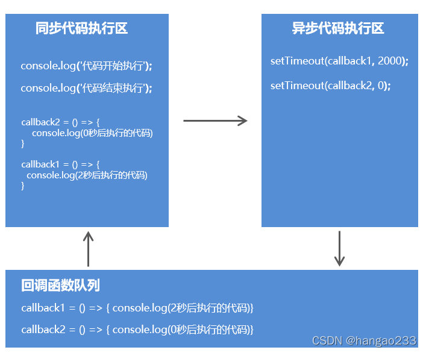

### promise 入门简介

####  JS 中分同步Api 和 异步Api。

同步API：只有当前API执行完成后，才能继续执行下一个API

```js
for (let i = 0; i < 10000; i++) {
    console.log(i);
}
console.log('同步代码执行');
```

> 只有上面一万行数值打印完，才会打印’同步代码执行’

异步API：当前API的执行不会阻塞后续代码的执行

```js
console.log('before');
setTimeout(
   () => { console.log('last');
}, 2000);
console.log('after');
```

setTimeout定时器要在2s秒后才执行，js引擎不会卡在定时器这，会先执行同步代码，等同步代码执行完再执行异步代码定时器(在这只需要先记住定时器是异步代码)


#### 同步API, 异步API的区别（ 获取返回值 ）

同步API可以从返回值中拿到API执行的结果, 但是异步API是不可以的

**同步：**

```js
// 同步
function sum (n1, n2) { 
	return n1 + n2;
} 
const result = sum(10, 20); // result 值为 30
```

**异步：**

```js
function getMsg () { 
	setTimeout(function () { 
		return { msg: 'Hello Node.js' }
	}, 2000);
}
const msg = getMsg(); // msg 的值是 undefined
```

####  回调函数

自己定义函数让别人去调用。

使用回调函数可以获取异步API执行结果

```js
function getMsg (callback) {
    setTimeout(() => {
        let a = '异步函数结果'
        callback(a)
    }, 2000)
}

getMsg((result) => {
    console.log(result); // 异步函数结果
})
```

#### 代码执行顺序分析

```js
console.log('代码开始执行');
setTimeout(() => {
	console.log('2秒后执行的代码');
}, 2000);
setTimeout(() => {
	console.log('0秒后执行的代码');
}, 0)
console.log('代码结束执行')
```



> 异步代码执行区的异步函数执行完成，将要执行专属的回调函数时，就会将回调函数放入回调函数队列，等同步代码执行区的代码执行完成后，就把回调函数队列的回调函数加入同步代码执行区。

####  JS 常见异步编程

- fs 文件操作
- 数据库操作
- AJAX 网络请求
- 定时器 （setTimeout）

#### Promise 出现的需求

我们先来个场景：

现在需要用 fs 文件操作 读取文件，但读取文件的顺序必须是先读A，再读B，再读C。

因为 fs 文件操作是异步的，没办法写成同步代码那样，按顺序如下

> 假设 fs 文件操作 是 同步的

```js
const fs = require('fs')

fs.readFile('a.txt');
fs.readFile('b.txt');
fs.readFile('c.txt');
```

> 但 fs文件操作 是异步编程， 要按照顺序读取的话就不能写成同步代码的形式，只能这样写：

```js
const fs = require('fs')

fs.readFile('a.txt', (err, data) => {
    console.log('第一个执行', data);
    fs.readFile('b.txt', (err, data) => {
        console.log('第二个执行', data);
        fs.readFile('c.txt', (err, data) => {
            console.log(data);
        })
    })
})
```

> 连续嵌套着的回调函数可读性非常差，也称为回调地狱

**Promise出现的目的是解决Node.js异步编程中回调地狱的问题。**

先来一个Promise 案例，有个感性的认识

```js
// resolve 解决
// reject 拒绝
// promise 的执行流程如下：
// promise 接收的参数是一个回调函数，回调函数有两个参数，resolve和 reject，在这个回调函数内部包裹一个异步操作，这个异步操作成功就调用resolve函数，失败就调用 reject
// promise 可以进行链式调用，promise.then() 是对象成功的回调， promise.catch() 是对象失败的回调
let promise = new Promise((resolve, reject) => {
    setTimeout(() => {
        if (true) {
            resolve({name: 'aaaaa'}) // 将 promise 对象的状态设置为 成功
        } else {
            reject('失败了') // 将 promise 对象的状态设置为 失败
        }
    }, 2000);
});

promise.then(result => {
    console.log(result);
}).catch( err => {
    console.log(err);
})
```

**Promise解决 按顺序读取A文件，B文件，C文件 的回调地狱问题**：

> 先有个感性的认识

```js
const fs = require('fs')

let p1 = new Promise((resolve, reject) => {
    fs.readFile('a.txt', 'utf-8', (err, data) => {
        resolve(data)
    })
})

let p2 = new Promise((resolve, reject) => {
    fs.readFile('b.txt', 'utf-8', (err, data) => {
        resolve(data)
    })
})

let p3 = new Promise((resolve, reject) => {
    fs.readFile('c.txt', 'utf-8', (err, data) => {
        resolve(data)
    })
})

p1.then(r1 => {
    console.log(r1);
    return p2;
}).then(r2 => {
    console.log(r2);
    return p3;
}).then(r3 => {
    console.log(r3);
})
```

### Promise 常见常见练习

####  promise 实践练习-fs读取文件

```js
// 不使用 promise
const fs = require('fs');

fs.readFile('./test.txt', (err, data) => {
    // 出错，抛出错误
    if (err) throw err;
    console.log(data.toString());
})

// 使用 Promise 包裹
let promise = new Promise((resolve, reject) => {
    fs.readFile('./test.txt', (err, data) => {
        if (err) reject(err);
        resolve(data.toString());
    })
})

// 调用 promise 封装的异步函数
promise.then(result => {
    console.log(result);
})
```

#### promise 实践练习-AJAX请求

```js
// 原生
const btn = document.querySelector('#btn');
btn.addEventListener("click", () => {
    // 创建对象
    const xhr = new XMLHttpRequest();
    // 初始化
    xhr.open('GET', 'https://api.apiopen.top/getJoke');
    // 发送
    xhr.send();
    // 处理响应结果
    xhr.onreadystatechange = function () {
        if (xhr.readyState === 4) {
            // 判断响应状态码
            if (xhr.status >= 200 && xhr.status < 300) {
                // 控制台输出响应体
                console.log(xhr.response);
            } else {
                // 控制台输出状态码
                console.log(xhr.status);
            }
        }
    }
})

// promise 封装
btn.addEventListener("click", () => {
    // 创建 Promise
    const promise = new Promise((resolve, reject) => {
        // 创建对象
        const xhr = new XMLHttpRequest();
        // 初始化
        xhr.open('GET', 'https://api.apiopen.top/getJoke');
        // 发送
        xhr.send();
        // 处理响应结果
        xhr.onreadystatechange = function () {
            if (xhr.readyState === 4) {
                // 判断响应状态码
                if (xhr.status >= 200 && xhr.status < 300) {
                    // 控制台输出响应体
                    resolve(xhr.response);
                } else {
                    // 控制台输出状态码
                    reject(xhr.status);
                }
            }
        }
    })

    promise.then(result => {
        console.log(result);
    }).catch(err => {
        console.log(err);
    })
})
```

#### util.promisify 方法进行 promise 风格转化

> 这个是用在node.js 的环境下，我在用node.js 写后端时用到过这种方法

```
const util = require('util');

const fs = require('fs');
// 返回一个新的函数
// 这个函数的返回结果是promise 对象
let mineReadFile = util.promisify(fs.readFile);

mineReadFile('./test.txt').then(result => {
    console.log(result);
}).catch(err => {
    console.log(err);
})
```

#### promise 封装练习-AJAX请求

```js
/** 
         * 封装一个函数 sendAJAX 发送 GET AJAX 请求
         * 参数 URL
         * 返回结果 Promise 对象
         **/

function sendAJAX(url) {
    return new Promise((resolve, reject) => {
        const xhr = new XMLHttpRequest();
        xhr.open('GET', url);
        xhr.send();
        // 处理结果
        xhr.onreadystatechange = function () {
            if (xhr.readyState === 4) {
                if (xhr.status >= 200 && xhr.status < 300) {
                    resolve(xhr.response);
                } else {
                    reject(xhr.status)
                }
            }
        }
    })
}

sendAJAX('https://api.apiopen.top/getJoke').then(result => {
    console.log(result);
}).catch(err => {
    console.log(err);
})
```

###  promise 的详细介绍

在了解 promise 的基本流程前，先要知道 promise的一些基本属性

#### promise 的状态

promise 的状态时 promise实例对象中的一个属性 **[PromiseState]**

- pending 进行中
- resolved / fulfilled 成功
- rejected 失败

> 状态只能由 `Pending` 变为 `Fulfilled` 或由 `Pending` 变为 `Rejected` ，且状态改变之后不会在发生变化，会一直保持这个状态。

#### promise 对象的值

实例对象中的另一个属性 **[PromiseResult]**

保存着异步任务 [成功/失败] 的结果

- resolve
- reject

#### promise 的基本流程


#### promise Api 的详细介绍

#####  Promise 构造函数：Promise(executor)

(1) executor 函数：执行器 (resolve, reject) => {}

(2) resolve 函数：内部定义成功时我们调用的函数 value => {}

(3) reject 函数：内部定义失败时我们调用的函数 reason => {}

说明：executor 会在 Promise 内部立即同步调用，异步操作在执行器中执行

> 代码

```js
let p = new Promise((resolve, reject) => {
// 同步调用
	console.log(111);
});
	console.log(222);

//111
//222
```

##### Promise.prototype.then 方法 (onResolved, onRejected) => {}

(1) onResolved 函数：成功的回调函数 (value) => {}

(2) onRejected 函数：失败的回调函数 (reason) => {}

说明：指定用于得到成功 value 的成功回调和用于得到失败 reason 的失败回调返回一个新的 promise 对象

```js
promise.then(value => {
    console.log(value);
}, reason => {
    console.log(reason);
})
```

##### Promise.catch 方法：(reason) => {}

(1) reason：失败的数据或Promise对象

说明：返回一个 失败的 promise 对象

```js
sendAJAX('https://api.apiopen.top/getJoke').catch(reason => {
             console.log(reason);
         })
```

##### Promise.resolve 方法：(value) => {}

(1) value：成功的数据或 promise 对象

说明：返回一个成功/失败的 promise 对象

```js
// 如果传入的参数为 非 promise类型的对象，则返回的结果为成功的promise对象
let p1 = Promise.resolve(521);
// 如果传入的参数为 promise 对象，则参数的结果决定了 resolve 的结果
let p2 = Promise.resolve(new Promise((resolve, reject) => {
    resolve('ok');
}))
console.log(p2);
```

#####  Promise.reject 方法：(reason) => {}

(1) reason：失败的原因

说明：返回一个失败的 promise 对象

```js
let p1 = Promise.reject(521)
let p2 = Promise.reject(new Promise((resolve, reject) => {
    resolve('ok')
}))
```

##### Promise.all 方法：(promises) => {}

(1) promises：包含 n 个 promise 的数组

说明：返回一个新的 promise，只有所有的 promise 都成功才成功，只要有一个失败了就直接失败


##### Promise.race 方法：(promises) => {}

(1) promises：包含 n 个 promise 的数组

说明：返回一个新的 promise，第一个完成的 promise 的结果状态就是最终的结果状态


### promise 的几个关键问题

#### 一：如何改变 promise 的状态

```js
let p = new Promise((resolve, reject) => {
    // 1. resolve 函数
    resolve('ok') // pending ---> fulfilled
    // 2. reject 函数
    reject('err') // pending ---> rejected
    // 3. 抛出错误
    throw '出问题了';
})
```

#### 二：一个 promise 指定多个成功/失败回调函数，都会调用吗？

当 promise 改变为对应状态时都会调用

```js
let promise = new Promise((resolve, reject) => {
    resolve('Ok');
})

// 指定回调函数
promise.then(res => {
    console.log(res);
})

promise.then(res => {
    alert(res);
})
```

#### 三：改变 promise 状态 和 指定回调函数谁先谁后？

(1)：都有可能，正常情况下是先指定回调再改变状态，但也可以先改变状态再指定回调

> 正常情况
>
> promise 执行器内部是 异步操作，所以是先指定回调，再改变状态

```js
let promise = new Promise((resolve, reject) => {
    setTimeout(() => {
        // 再改变状态
        resolve('Ok')
    }, 1000)
})

// 先指定回调
promise.then(res => {
    // 但 res 结果的获得，必须要等异步执行结束，状态改变才能获取到
    console.log(res);
})
```

(2)：如何先改状态再指定回调？

- 在执行器中直接调用 resolve() / reject()

- 延迟更长时间才调用 then()

  ```js
  let promise = new Promise((resolve, reject) => {
      // 同步操作，直接先改变状态
  resolve('Ok');
  })
  
  // 再指定回调
  promise.then(res => {
      console.log(res);
  })
  ```

#### 四：promise.then() 返回的新 promise 的结果状态由什么决定

(1) 简单表达：由 then() 指定的回调函数执行

(2) 详细表达：

- 如果抛出异常，新 promise 变为 rejected，reason 为 抛出的异常
- 如果返回的是非 promise 的任意值，新 promise 变为 resolved， value为返回的值
- 如果返回的是另一个新 promise，此 promise 的结果就会成为 新 promise 的结果

```js
let promise = new Promise((resolve, reject) => {
    resolve('Ok');
})

promise.then(res => {
    console.log(res);
    // 1. 抛出错误
    // throw '出了问题'
    // 2. 返回结果非 promise 对象
    return 123;
    // 3. 返回结果是promise 对象
    return new Promise((resolve, reject) => {
        resolve('DDD');
    })
})
```

#### 五：promise 如何串连多个操作任务？

(1) promise 的 then() 内部返回一个新的 promise，可以 .then() 进行链式调用

(2) 通过 then 的链式调用串连 多个同步/异步任务

> 就最开始提出按顺序读取a.txt , b.txt, c.txt 终于可以解释了。
>
> 如何用promise 解决回调地狱

```js
const fs = require('fs')

let p1 = new Promise((resolve, reject) => {
    fs.readFile('a.txt', 'utf-8', (err, data) => {
        resolve(data)
    })
})

let p2 = new Promise((resolve, reject) => {
    fs.readFile('b.txt', 'utf-8', (err, data) => {
        resolve(data)
    })
})

let p3 = new Promise((resolve, reject) => {
    fs.readFile('c.txt', 'utf-8', (err, data) => {
        resolve(data)
    })
})

p1.then(r1 => {
    console.log(r1);
    return p2;
}).then(r2 => {
    console.log(r2);
    return p3;
}).then(r3 => {
    console.log(r3);
})
```

#### 六：promise 异常穿透

(1) 当使用 promise 的 then 链式调用时，可以在最后指定失败的回调

(2) 前面任何操作出了异常，都会传到最后失败的回调中处理

```js
let promise = new Promise((resolve, reject) => {
    reject('Err');
})

let p = promise.then(res => {
    // console.log(111);    
    throw '失败了';
}).then(value => {
    console.log(222);
}).then(value => {
    console.log(333);
}).catch(reason => {
    console.log(reason);
})
```

#### 七：中断 promise 链？

(1) 当使用 promise 的 then 链式调用时，在中间中断，不再调用后面的回调函数

(2) 办法：在回调函数中返回一个 pendding 状态的 promise 对象

```js
let promise = new Promise((resolve, reject) => {
    resolve('Ok');
})

let p = promise.then(res => {
    console.log(111);    
    // 有且只有一个方式
    // 回调函数执行的前提是  在状态改完之后才能执行。
    // 这里返回的promise 状态是 pendding
    return new Promise(() => {});
}).then(value => {
    console.log(222);
}).then(value => {
    console.log(333);
}).catch(reason => {
    console.log(reason);
})
```

