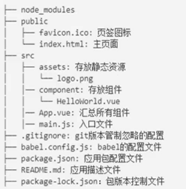
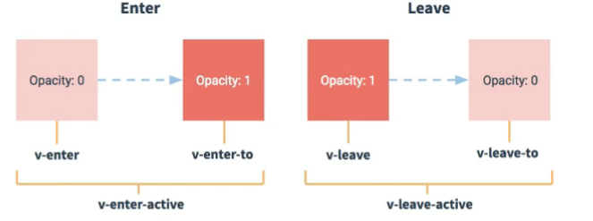

## Vue组件

#### Vue组件化编程

##### 模块与组件，模块化与组件化

1.模块

概念：向外提供特定功能的js程序，一般就是一个js文件

作用：复用，简化，效率

2.组件

概念：实现应用中局部功能代码和资源的集合

作用：复用，简化，效率

3.模块化

应用中的js都以模块来编写的，那么这个应用就是一个模块化的应用

4.组件化

应用中的功能都是多组件的方式来编写的，那这个应用就是一个组件化的应用。


#### 非单文件组件

概念：一个文件中包含有n个组件

Vue中使用组件的三大步骤：
一、定义组件（创建组件）
二、注册组件
三、使用组件（写组件标签）

一、如何定义一个组件？
使用Vue,extend(options)创建，其中options和new Vue(options)时传入的那个options几乎一样，但也有点区别：
区别如下：
1.e1不要写，为什么？
最终所有的组件都要经过一个vm的管理，由vm中的e1决定服务哪个容器。
2data必须写成函数
为什么？
避免组件被复用时，数据存在引用关系。
备注：使用template可以配置组件结构。

二、如何注册组件？
1,局部注册：靠new Vue的时候传入components.选项
2.全局注册：靠Vue.component('组件名'，组件)
心英
三、编写组件标签：

```js
<school></school>
```


##### 几个注意点：

1.关于组件名：
		个单词组成：
			

```
第一种写法（首字母小写）：schoo1
第二种写法（首字母大写）：Schoo1
```

​		多个单词组成：
​				

```
第一种写法(kebab-case命名)：my-school
第二种写法(CamelCase命名)：MySchool(需要Vue脚手架支持)
```

备注：
		(1).组件名尽可能回避HTML中已有的元素名称，例如：h2、H2都不行。
		(2).可以使用name配置项指定组件在开发者工具中呈现的名字。

```js
const s = Vue.extend({
name:school,  //开发者工具中呈现的名字
})
```

2,关于组件标签：
		

```
第一种写法：<schoo1></schoo1>
		第二种写法：<school/>l
```

备注：不用使用脚手架时，<school/>会导致后续组件不能渲染。

3,一个简写方式：
		

```
const school=Vue,extend(options)可简写为：const school=options
```

#####  

关于VueComponent:
	1,school组件本质是一个名为VueComponent的构造函数，且不是程序员定义的，是Vue,extend生成的。
	

​	2.我们只需要写<school/>或<school></school>,Vue解析时会帮我们创建school组件的实例对象，
​		即Vue抒我们执行的：new VueComponent(options)。
​	

​	3.特别注意：每次调用Vue,extend,返回的都是一个全新的VueComponent!!!!

​	4.关于this指向：
​		(1).组件配置中：
​				data函数、methods中的函数、watch中的函数、computed中的函数它们的this均是【VueComponent				实例对象】
​		(2).new Vue()配置中：
​				data函数、methods中的函数、watch中的函数、computed中的函数它们的this均是【Vue实例对				象】。
​	

​	5.VueComponent的实例对象，以后简称vc(也可称之为：组件实例对象)。
​		Vue的实例对象，以后简称vm。


#### 单文件组件


概念：一个文件中只包含有1个组件


一个组件一个文件，文件扩展名为vue

**结构**

```js
<template>
  //组件模板
</template>

<script>
export default {
	name:'组件名',
	data(){
	
	}
}
</script>

<style>
//组件样式
</style>
```


## Vue脚手架

cmd执行：npm config set registry https://registry.npm.taobao.org

改为淘宝的镜像

第一步：全局安装@vue/cli  npm install  -g @vue/cli

第二部：切换你的项目目录，然后使用命令创建项目

vue create xxxx

选择你想使用的版本


第三步：启动项目

npm run serve


**注意**：文件中的组件一定要用大驼峰命名法来命名。

除非关闭语法检查。


**关于不同版本的Vue:**

​	1.vue.js与vue.runtime.xxx.js的区别:

​			(1).vue.js是完整版的Vue，包含：核心功能+模板解析器。

​			(2).vue.runtime.xxx.js没有模板解析器，所以不能使用template配置项，需要使用render函数接收到的createElement函数去指定具体内容。


**vue inspect > output.js**  

终端下执行，会将Vue脚手架里的配置文件全部整理为output.js的文件


**脚手架文件结构**




**关于不同版本的Vue：**

vue.js与vue.runtime,xxx.js的区别：
		(1).vue.js是完整版的Vue,包含：核心功能+模板解析器。
		(2),vue.runtime,xxx,js是运行版的Vue,只包含：核心功能：没有模板解析器。

因为vue.runtime,xxx,js没有模板解析器，所以不能使用templatei配置项，需要使用render函数接收到的createElement函数去指定具体内容。


**vue.config.js配置文件**

使用vue.config.js可以对脚手架进行个性化定制, 详情见：https://cli.vuejs.org/zh


### ref属性

1.被用来给元素或子组件注册引起信息（id的替代）

2.应用在html标签上获取的是真实DOM元素，应用在组件标签上是组件实例对象（vc）

3.使用方式：

```
打标识：<h1 ref="xxx"> ......</h1> 或<School ref="xxx"></School>
获取: this.$refs.xxx
```


### props配置项

功能：让组件接收外部传过来的数据

（1）传递数据：

```js
<Demo name="xxx"/>
```

（2）接收数据

```js
第一种方法（只接收）
props:['name']
第二种方法（限制类型）
props:{
     name:String,
}
第三种方式（限制类型、限制必要性、指定默认值）：
props:{
      name:{
        type: String,  //name的字符类型是字符串
        required:true,  //name是必要的
        default:'老王'   //默认值
      }
}
```


备注：props是只读的，Vue底层会监测你对props的修改，如果进行了修改，就会发出警告，若业务需求确实需要修改，那么请赋值props的内容到data中一份，然后去修改data中的数据。


### mixin（混入）

功能：可以把多个组件共用的配置提取成一个混入对象

使用方法：

```
第一步定义混合，例如：
export const mixin_name = {
data(){...},
methods:{...}
...
}
第二部使用混入，例如：
（1）.全局混入：Vue.mixin(mixin_name)
（2）.局部混入：mixins:[mixin_name]
```


### 插件

功能：用于增强Vue

本质：包含install方法的一个对象，install的第一个参数是Vue，第二个以后的参数是插件使用者传递的数据。

定义插件：

```
对象.install = function(Vue,options){
//1.添加全局过滤器
Vue.filter(...)
//2.添加全局指令
Vue.directive(...)
//3.配置全局混入（合）
Vue.mixin(...)
//4.添加实例方法
Vue.prototype.$myMethod = function(){...}
Vue.prototype.$myProperty = xxxx
}
```

使用插件： Vue.use(插件名)


### 组件间的通信

#### 兄弟间通信

方法1：

父亲在methods中创建一个方法，将方法传入儿子

儿子就可以通过方法把数据传入父亲，

父亲就能够将数据传入儿子

```
父亲：
<Son :fangfa="fangfa"/>
data(){
    return{
    ...(数据)
    }
}
methods:{
    fangfa(jieshou){
    ...
    }
}

儿子：
props['fangfa']
```


### <span style="color:red; font-size:40px;">I</span>  TodoList案例总结

1.组件化编码流程

​	(1),拆分静态组件：组件要按照功能点拆分，命名不要与htm1元素冲突。
​	(2),实现动态组件：考虑好数据的存放位置，数据是一个组件在用，还是一些组件在用：

​		1),一个组件在用：放在组件自身即可。

​		2),一些组件在用：放在他们共同的父组件上（<span style="color:red">状态提升</span>）

​	(3),实现交互：从绑定事件开始。

2.props适用于：

​	（1）父组件 ==> 子组件 通信

​	（2）子组件 ==> 父组件 通信（要求父先给子一个函数）

3.使用v-model时要切记：v-model绑定的值不能是props传过来的值，因为props是不可以修改的！

4.props传过来的若是对象类型的值，修改对象中的属性时Vue不会报错，但不推荐这样做。


### webStorage

1.存储内容大小一般支持5MB左右（不同的浏览器可能不一样）

2.浏览器端通过Window.sessionStroage和Window.localStorage属性来实现本地存储机制。

3.相关API：

```
1.xxxxStorage.setItem('key','value');
该方法接受一个键和值作为参数，会把键值对添加到存储中如果键名存在，则更新其对应的值。

2.xxxxStorage.getItem('person');
该方法接受一个键名作为参数，返回键名对应的值。

3.xxxxStorage.removeItem('key');
该方法接受一个键名作为参数，返回键名对应的值。

4.xxxxStroage.clear();
该方法会清空存储中的所有数据。
```


4.备注：

​		1.SessionStorage存储的内容会随着浏览器窗口关闭而消失。

​		2.LocalStorage存储的内容，需要手动清除才会消失。

​		3.xxxxxStorage.getItem(xx)如果o对应的value获取不到，那么getltem的返回值是null,

​		4.JSoN.parse(nul1)的结果依然是null。


### 组件的自定义事件

1.一种组件间通信的方式，适用于：子组件 ==> 父组件 

2.使用场景：A是父组件，B是子组件，B想给A传数据，那么就要在A中给B绑定自定义事件（事件的回调在A中）。

3.绑定自定义事件：

​		1.第一种方式，在父组件中：`<Demo @EventName="test"/>`或`<Demo v-on:EventName="test"/>`

​		2.第二种方式，在父组件中：

```js
<Demo ref="demo"/>
......
mounted(){
	this.$refs.demo.$on('EventName',this.test)
}
```

​		3.若想让自定义事件只能触发一次，可以使用once修饰符，或者$once方法。

4.触发自定义事件：`this.$emit('EventName',数据)`

5.解绑自定义事件`this.$off('EventName')`

6.组件上也可以绑定原生DOM事件，需要使用native修饰符。

7.注意：通过`this.$refs.xxx.$on('EventName',回调)`绑定自定义事件时，回调要么配置在methods中，要么用箭头函数，否则this指向会出问题！


### 全局事件总线（GlobalEventBus）

1.一种组件间通信的方式，适用于任意组件间的通信（是程序员在开发过程中发现的一种方法）

2.安装全局事件总线：

```js
new Vue({
    ....
    beforeCreate(){
    	Vue.prototype.$bus = this //安装全局事件总线
}
})
```

3.使用事件总线：

​	1.接受数据：A组件像接受数据，则在A组件中给$bus绑定自定义事件，事件**回调留在A组件自身。**

```js
mounted(){
    // console.log('School',this);
    this.$bus.$on('hello',(data)=>{
      console.log('我是School组件，我收到了数据',data);
    })
  },
  beforeDestroy(){
    this.$bus.$off('hello')
  }
```

​		2.提供数据：`this.$bus.$emit('xxxx',数据)`

4.最好在beforeDestroy钩子中，用$off去解绑**当前组件所用到的**事件。

```js
 beforeDestroy(){
    this.$bus.$off('hello')
  }
```


### 消息订阅与发布（pubsub）

1.一种组件间通信的方式，适用于**任意组件间通信。**

2.使用步骤：

​		1.安装pubsub: `npm i pubsub-js`

​		2.引入：`import pubsub from 'pubsub-js'`

​		3.接收数据：A组件像接收数据，则在A组件中订阅消息，订阅的**回调留在A组件自身**。		

```js
methods:{
	demo(data){
        ....
    }
}
.....
mounted(){
    this.pid = pubsub.subscribe('xxx',this.demo) //订阅消息
}
```

4.提供数据：`pubsub.publish('xxx',数据)`

5.最好在beforeDestroy钩子中，用`pubSub.unsubscribe(pid)`去**取消订阅**。


### nexTick（改变代码执行顺序）

1.语法`this.$nextTick(回调函数)`

2.作用：在下一次DOM更新结束后执行其指定的回调。

3.什么时候用：当该表数据后，要基于更新后的新DOM进行某些操作时，要在nextTick所指定的回调函数中执行。


### Vue封装的过度与动画

1.作用：在插入、更新或一处DOM元素时，在核实的时候给元素添加样式类名。

2.图示：



3.写法：

1. 准备好样式：

   - 元素进入的样式：
     1. v-enter:进入的起点
     2. v-enter-active：进入过程中
     3. v-enter-to：进入的终点
   - 元素离开的样式：
     1. v-leave：离开的起点
     2. v-leave-active：离开过程中
     3. v-leave-to：离开的终点

2. 使用`<transition>`包裹要过度的元素，并配置name属性：

   ```js
   <transition name="hello">
       <h1 v-show="isShow”>你好啊！</h1>
   </transition>
   ```

   

3. 备注：若有多个元素需要过度，则需要使用：`<transition-group>`,且每个元素都要指定`key`值。


### vue脚手架配置代理

##### 方法一

在vue.config.js中添加如下配置：

```js
devServer:{
    proxy:"http://localhost:5000"
}
```

说明：

1. 优点：配置简单，请求资源时直接发给前端（8080）即可。
2. 缺点：不能配置多个代理，不能灵活的控制请求是否走代理。
3. 工作方式：若按照上述配置代理，当请求了前端不存在的资源时，那么该请求会转发给服务器（优先匹配前端资源）

##### 方法二

编写vue.config.js配置具体代理规则：

```js
module.exports = {
    devServer: {
        proxy: {
          '/api': {  //匹配所有以'/api'开头的请求路径
            target: 'http://localhost:5000',  //代理目标的基础路径
            pathRewrite:{'^/api':''},
            ws: true,  //用于支持websocket 不写默认true
            changeOrigin: true //用于控制请求头中的host值 不写默认true
          },
          '/demo':{
            target: 'http://localhost:5001',
            pathRewrite:{'^/demo':''},
          }
        }
      }
}
```

说明：

1. 优点：可以配置多个代理，且可以灵活的控制请求是否走代理。
2. 缺点：配置略微繁琐，请求资源时必须加前缀。


##### 发请求得数据

1.安装axios

```
npm i axios
```

2.引入

```js
import axios from 'axios'
```

3.使用

```js
axios.get(`服务器文件地址`).then(
                response =>{
                    console.log('请求成功了',response);
                },
                error => {
                    console.log('请求失败了',error.message);
                }
            )
```


### 插槽

1. 作用：让父组件可以向子组件指定位置插入html结构，也是一种组件间通信的方式，适合用于**父组件 ===> 子组件**。

2. 分类：默认插槽、具名插槽、作用域插槽

3. 使用方式：

   1. 默认插槽：

      ```vue
      父组件中：
              <Category>
                  <div>html结构</div>
              </Category>
      子组件中：
              <template>
                <div>
                        //定义插槽
                  <slot>我是默认插槽，当使用者没传具体结构时我会显示。</slot>
                </div>
              </template>
      		
      ```

   2. 具名插槽：

      ```vue
      父组件中：
              <Category>
                  <template slot="center">
                      <div>html结构</div>
                  </template>
              </Category>
      		<Category>
                  <template v-slot:footer>
                      <div>html结构</div>
                  </template>
              </Category>
      子组件中：
              <template>
                <div>
                        //定义插槽
                  <slot name="center">我是默认插槽，当使用者没传具体结构时我会显示。</slot>
                    <slot name="footer">我是默认插槽，当使用者没传具体结构时我会显示。</slot>
                </div>
              </template>父组件中：
      ```

   3. 作用域插槽：

      1. 理解：**数据在组件自身，但根据数据生成的结构需要组件的使用者来决定**。（games数据在Category组件中，但是用数据所遍历出来的结构由App组件来决定）

      2. 具体编码：

         ```vue
         父组件中：
                 <Category>
                   <template scope="scopeData">
                     <ul >
                       <li v-for="g in scopeData.games" >{{g}}</li>
                     </ul> 
                   </template>
                 </Category>
                 <Category title="游戏">
                   <template slot-scope="{games}">
                     <ol>
                       <li v-for="g in games" >{{g}}</li>
                     </ol> 
                   </template>
                 </Category>
         子组件中：
                 <template>
                           <div>
                                   //定义插槽
                             <slot :games="games">我是默认插槽，当使用者没传具体结构时我会显示。</slot>
                           </div>
                  </template>
                 <script>
                 export default {
                     name:'Category',
                     props:['title'],
                     //数据在子组件本身
                     data() {
                       return {
                          games:['鬼泣','逃生','幽浮','饥荒'],
                       }
                     },
         
                 }
                 </script>
         ```

         

### vuex

1. ### vuex是什么

   1. 概念：专门在Vue中实现集中式状态（数据）管理的一个Vue插件，对vue应用中多个组件的共享状态进行集中式的管理（读/写），也是一种组件间通信的方式，且适用于任意组件间通信。
   2. Github地址：https://github.com/vuejs/vuex

2. ### 搭建vuex环境

   1. 安装vuex

      ```
      npm i vuex   //这是最新版的
      npm i vuex@3  //vue2匹配vuex3
      ```

   2. 创建文件：`src/store/index.js`

      ```js
      //引入Vue核心库
      import Vue from 'vue'
      
      // 引入vuex
      import Vuex from 'vuex'
      
      //使用vuex
      Vue.use(Vuex)
      
      //准备actions对象--响应组件中用户的动作
      const actions = {}
      //准备mutations对象--修改state中的数据
      const mutations = {}
      //准备state对象--保存具体的数据
      const state = {}
      
      //创建并暴露store
      export default new Vuex.Store({
          actions,
          mutations,
          state
      })
      ```

   3. 在`main.js`中创建vm时传入`store`配置项

      ```js
      //引入组件
      import Vue from 'vue'
      import App from './App.vue'
      //引入插件
      // import vueResource from 'vue-resource'
      import store from './store'
      //关闭生产提示
      Vue.config.productionTip = false
      //使用插件
      // Vue.use(vueResource)
      // Vue.use(Vuex)
      new Vue({
        el:"#app",
        render: h => h(App),
        store
      })
      ```

3. ### 基本使用

   1. 初始化数据、配置`actions`、配置`mutations`，操作文件store.js

      ```js
      //引入Vue核心库
      import Vue from 'vue'
      
      // 引入vuex
      import Vuex from 'vuex'
      
      //使用vuex
      Vue.use(Vuex)
      
      //准备actions对象--响应组件中用户的动作
      const actions = {
          jiaOdd(context,value){
              if(context.state.sum % 2)
              context.commit('JIA',value)
          },
          jiaWait(context,value){
             setTimeout(() => {
              context.commit('JIA',value)
             }, 500);
          }
      }
      //准备mutations对象--修改state中的数据
      const mutations = {
          JIA(state,value){
              state.sum += value 
          },
          JIAN(state,value){
              state.sum -= value 
          }
      }
      //准备state对象--保存具体的数据
      const state = {
          sum:9
      }
      
      //创建并暴露store
      export default new Vuex.Store({
          actions,
          mutations,
          state,
          getters
      })
      ```

   2. 组件中读取vuex中的数据:`$store.state.sum`

   3. 组件中修改vuex中的数据：`$store.dispatch('action中的方法名',数据)`或`$store.commit('mutations中的方法名',数据)`

      > 备注：若没有网络请求或其他业务逻辑，组件中也可以越过actions，即不写`dispatch`,直接编写`commit`

4. ### getters的使用

   1. 概念：当state中的数据需要经过加工后在使用时，可以使用getters加工。

   2. 在`store.js`中追加`getters`配置

      ```js
      .....
      const getters = {
          bigSum(state){
              return state.sum*10
          }
      }
      
      
      //创建并暴露store
      export default new Vuex.Store({
          ......
          getters
      })
      ```

   3. 组件中读取数据：  `$store.getters.bigSum`

5. ### 四个map方法的使用

   1. **mapState方法**：用于帮助我们映射`state`中的数据为计算属性

      ```js
      computed:{
          // 借助mapState生成计算属性，从state中读取数据，对象写法
            ...mapState({sum:'sum',school:'school',subject:'subject'}),
      
          // 借助mapState生成计算属性，从state中读取数据，对象写法
          ...mapState(['sum','school','subject']),
      }
      ```

   2. **mapGetters方法**：用于帮助我们映射`getters`中的数据为计算属性

      ```js
      computed:{
          // 借助mapGetters生成计算属性，从getters中读取数据，对象写法
            ...mapGetters({bigSum:'bigSum'})
          // 借助mapGetters生成计算属性，从getters中读取数据，对象写法
          ...mapGetters(['bigSum'])
      }
      ```

   3. **mapMutations方法：**用于帮组我们生成与`mutations`对话的方法，即：包含`$store.commit(xxx)`的函数

      ```js
      // 借助mapMutations生成方法，方法中会调用commit去练习Mutations，对象写法
            ...mapMutations({increment:'JIA',decrement:'JIAN'}),
      // 借助mapMutations生成方法，方法中会调用commit去练习Mutations，数组写法
             ...mapMutations(['JIA','JIAN']), 
      ```

   4. **mapActions方法：**用于帮组我们生成与`mutations`对话的方法，即：包含`$store.dispatch(xxx)`的函数

      ```js
       // 借助mapMutations生成方法，方法中会调用commit去练习Mutations，对象写法
        ...mapActions({incrementOdd:'jiaOdd',incrementWait:'jiaWait'}),
        // 借助mapMutations生成方法，方法中会调用commit去练习Mutations，数组写法
        ...mapActions(['jiaOdd','jiaWait']), 
      ```

      > 备注：mapActions与mapMutations使用时，若需要传递参数需要：在模板中绑定事件时传递好参数，否则参数是事件对象。

6. ### 模块化+命名空间

   1. 目的：让代码更好维护，让多种数据分类更加明确。

   2. 修改`store.js`

      ```js
      const countAbout = {
          namespaced:true,  //开启命名空间
          actions:{...},
          mutations:{...},
          state:{...},
          getters:{
              bigSum(state){
                  return state.sum*10
              }
          }
      }
                     
      const personAbout = {
          namespaced:true,  //开启命名空间
          actions:{...},
          mutations:{...},
          state:{...},
      }
                     
      const store = new Vuex.Store({
          modules: {
              countAbout,
              personAbout
        }
      })
      ```

   3. 开启命名空间后，组件中读取state数据：

      ```js
      //方式一：自己直接读取
      this.$store.state.personAbout.list
      //方式二：借助mapState读取
      ...mapState('countAbout',['sum','school','subject']),
      ```

   4. 开启命名空间后，组件中读取state数据：

      ```js
      //方式一：自己直接读取
      this.$store.getters['personAbout/firstPonsonName']
      //方式二：借助mapGetters读取
      ...mapGetters('countAbout',['bigSum'])
      ```

   5. 开启命名空间后，组件中调用dispatch

      ```js
      //方式一：自己直接dispatch
      this.$store.dispatch('personAbout/addPersonWang',person)
      //方式二：借助mapActions读取
      ...mapActions('countAbout',{incrementOdd:'jiaOdd',incrementWait:'jiaWait'}),
      ```

   6. 开启命名空间后，组件中调用commit

      ```js
      //方式一：自己直接commit
      this.$store.commit('personAbout/ADD_PERSON',person)
      //方式二：借助mapMutations
      ...mapMutations('countAbout',{increment:'JIA',decrement:'JIAN'}),
      ```

      


### 路由（vue-router）

#### 相关理解

1. #### vue-router 的理解

   vue的一个插件库，专门用来实现SPA应用

2. #### SPA应用的理解

   1. 单页Web应用（single page web application,SPA）.
   2. 整个应用**只有一个完成的页面。**
   3. 点击页面中的导航连接**不会刷新**页面，只会做页面的局部更新。
   4. 数据需要通过ajax请求获取

3. #### 路由的理由

   1. ##### 什么是路由

      1. 一个路由就是一组映射关系（key - value）
      2. key为路径，value可能是function或component

   2. ##### 路由分类

      1. 后端路由：
         - 理解：value是function，用于处理客户端提交请求。
         - 工作过程：服务器接收到一个请求时，根据**请求路径**找到匹配的**函数**来处理请求，返回响应数据。
      2. 前端路由：
         - 理解：value是component，用于展示页面内容。
         - 工作过程：当浏览器的路径发生改变时，对应的组件就会显示。


#### 基本路由

1. 安装vue-router

   ```
   npm i vue-router@3  //对应vue2版本，直接安装的是最新版
   ```

2. 应用插件`Vue.use(VueRouter)`

3. 编写router配置项：

   ```js
   //该文件专门用于创建整个应用的路由器
   import VueRouter from "vue-router";
   //引入组件
   import About from "../components/About.vue";
   import Home from "../components/Home.vue";
   
   export default new VueRouter({
       routes:[
           {
               path:'/about',
               component:About
           },
           {
               path:'/home',
               component:Home
           }
       ]
   })
   ```

4. 实现切换（active-class可配置高亮样式）

   ```js
   <router-link class="list-group-item" active-class="active" to="/about">About</router-link>
   ```

5. 指定位置

   ```
   <router-view></router-view>
   ```

##### 几个注意点

1. 路由组件通常存放在`pages`文件夹，一般组件通常存放在`components`文件夹。
2. 通过切换，”隐藏“了的路由组件，默认是被销毁掉的，需要的时候再去挂载。
3. 每个组件都有自己的`$route`属性，里面存放着自己的路由信息。
4. 整个应用只有一个router，可以通过组件的`$router`属性获取到


#### 嵌套（多级）路由

1. 配置路由规则，使用children配置项：

   ```js
   routes:[
           {
               path:'/about',
               component:About
           },
           {
               path:'/home',
               component:Home,
               children:[
                   {
                       path:'news',
                       component:News
                   },
                   {
                       path:'message',
                       component:Message
                   }      
               ]
   
           }
       ]
   ```

2. 跳转（要写完整路径）：

   ```js
   <router-link to="/home/news">News</router-link>
   ```


#### 路由的query参数

1. 传递参数

   ```js
    <!-- 跳转路由并携带query参数，to的字符串写法 -->
                   <router-link :to="`/home/message/detail?id=${m.id}&title=${m.title}`">{{m.title}}</router-link>&nbsp;&nbsp;
                   <!-- 跳转路由并携带query参数，to的字符串写法 -->
                   <router-link :to="{
                       path:'/home/message/detail',
                       query:{
                           id:m.id,
                           title:m.title
                       }
                   }">{{m.title}}</router-link>
   ```

2. 接收参数：

   ```
   $route.query.id
   $route.query.title
   ```


#### 路由的命名

```js
routes:[
        {
            name:'guanyu',
            path:'/about',
            component:About
        },
],


:to"{
//path：'/about' 
//等同于
name：'guanyu'
}"
```


#### 路由的params

1. 配置路由，声明接收params参数

   ```
   {
       name:'xiangqing',
       path:'detail/:id/:title',
       component:Detail
   }
   ```

2. 传递参数

   ```js
   <!-- 跳转路由并携带params参数，to的字符串写法 -->
   <router-link :to="`/home/message/detail/${m.id}/${m.title}`">{{m.title}}</router-link>&nbsp;&nbsp;
   <!-- 跳转路由并携带params参数，to的字符串写法 -->
   <router-link 
   :to="{
       name:'xiangqing',
       params:{
           id:m.id,
           title:m.title
       }
   }">{{m.title}}</router-link>
   ```

   > 特别注意：路由携带params参数时，若使用to的对象写法，则不能使用path配置项，必须使用name配置！

3. 接收参数

   ```
   $route.params.id
   $route.params.title
   ```


#### 路由的props配置

作用：让路由组件更方便的收到参数

```js
{
    name:'xiangqing',
    path:'detail',
    component:Detail,
    // props的第一种写法，值为对象，该对象中的所有key-value都会以props的形式传给Detail组件
    // props:{a:1,b:'hello'}

    //props的第二种写法，值为布尔值，若布尔值为真，就会把该路由组件收到的所有param参数，以props的形式传给Detail组件
    // props:true

    //props的第三种写法，只值为函数
    props($route){
        return {id:$route.query.id,title:$route.query.title
               }
    }
    // props({query:{id,title}}){
    //     return {id,title}
    // }
}
```

#### `<router-link>`的replace属性

1. 作用：控制路由跳转时操作浏览器历史记录的模式’

2. 浏览器的历史记录有两种写入方式：分别为：`push`和`replace`，**push**是追加历史记录，**replace**是替换当前记录。路由跳转时候默认为**push**

3. 如何开启`replace`模式:

   ```vue
   <router-link replace .......>News</router-link>
   ```

   

#### 编程式路由导航

1. 作用：不借助`<router-link>`实现路由跳转，让路由跳转更加灵活

2. 具体编码

   ```js
   //$router的两个API
   this.$router.push({
                   name:'xiangqing',
                   query:{
                       id:m.id,
                       title:m.title
                   }
   })
   this.$router.replace({
                   name:'xiangqing',
                   query:{
                       id:m.id,
                       title:m.title
                   }
   }) 
   
   this.$router.back() //后退
   this.$router.forward()  //前进
   this.$router.go(3)  //负数是后退多少步，正数是前进多少步
   ```


#### 缓存路由组件

1. 作用：让不展示的路由组件保持挂载，不被销毁。

2. 具体编码：

   ```vue
   //单个
   <keep-alive include="News">
               <router-view></router-view>
   </keep-alive>
   //多个
   <keep-alive :include="['News','message']">
               <router-view></router-view>
   </keep-alive>
   或
   <keep-alive :include="News,message">
               <router-view></router-view>
   </keep-alive>
   ```


#### 两个新的生命周期钩子

1. 作用：路由组件所独有的两个钩子，用于捕获路由组件的激活状态。
2. 具体名字：
   1. `activated`路由组件被激活时触发。
   2. `deactivated`路由组件失活时触发。


#### 路由守卫

1. 作用：对路由进行权限控制

2. 分类：全局守卫、独享守卫、组件内守卫

3. ##### 全局守卫

   ```js
   //全局前置路由守卫---初始化时被调用、每次路由切换之前被调用
   router.beforeEach((to,from,next)=>{
       // console.log('前置路由守卫',to,from);
       if(to.meta.isAuth){  //判断当前路由是否需要进行权限控制
           if(localStorage.getItem('school')==='jialidun'){ //权限控制的具体规则
               next()  //放行
           }else{
               alert('学校名不对')
           }
       }else{
           next() //放行
       }
   })
   
   //全局后置路由守卫---初始化的时候被调用、每次路由切换之后被调用
   router.afterEach((to,from)=>{
       console.log('后置路由守卫',to,from);
       document.title = to.meta.title || '路由守卫'
   })
   ```

4. ##### 独享守卫：

   ```js
   beforeEnter(to,from,next){
   	if(to.meta.isAuth){                                            		if(localStorage.getItem('school')==='jialidun'){
               next()
           }else{
               alert('学校名不对')
           }
       }else{
           next()
       }
   }
   ```

5. ##### 组件内守卫

   ```js
   // 通过路由规则，进入该组件时被调用
   beforeRouteEnter (to, from, next) {
   next()
   },
   // 通过路由规则，离开该组件时被调用
   beforeRouteLeave (to, from, next) {
   next()
   }
   ```


#### 路由器的两种工作模式

1. 对于一个url来说，什么是hash值？-----#及其后面的内容就是hash值。
2. hash值不会包含在http请求中，即：hash值不会带给服务器。
3. hash模式
   1. 地址中永远带着#号，不美观。
   2. 若以后将地址通过第三方手机app分享，若app校验严格，则地址会被标记为不合法。
   3. 兼容性较好。
4. history模式：
   1. 地址干净，美观。
   2. 兼容性和hash模式相比略差。
   3. 应用部署上线时需要后端人员支持，解决刷新页面服务端404问题

脚手架打包

```
npm run build
```

hash模式开启，默认history模式

```
const router =  new VueRouter({
    mode:'hash',
```

解决服务器404问题

```js
//下载
npm i connect-history-api-fallback

//使用
var history = require('connect-history-api-fallback');
app.use(history())
```


### Vue UI 组件库

1. **移动端常用 UI 组件库** 

   1. Vant https://youzan.github.io/vant 

   2. Cube UI https://didi.github.io/cube-ui 

   3. Mint UI http://mint-ui.github.io 

1. **PC 端常用 UI 组件库** 

   1. Element UI https://element.eleme.cn 

   2. IView UI https://www.iviewui.com
