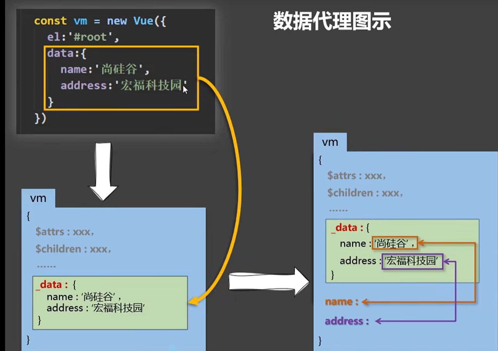

## 初识Vue

### Vue核心

1.想让Vue工作，就必须创建一个Vue实例，且要传入一个配置对象；

  2.root容器里的代码依然符合html规范，只是混入了一些特殊的Vue语法

  3.root容器里的代码别称为【Vue模板】 ；

  4.Vue实例和容器是一一对应的；

  5.实开发中只有一个Vue实例，并且会配合着组件一起使用；

  6.{{xxx}}中的xxx要写js表达式，且xxx可以自动读取到data中所有属性；

  7.一旦data中的数据发生改变，那么模板中用到该数据的地方也会自动更新；

```js
<div id="root">
        <h1>Hello {{name}}</h1>
    </div>

<script type="text/javascript">
    Vue.config.productionTip=false

    //创建Vue实例
    const vm = new Vue({  
    el:'#root',
    data:{
        name:'老王'
    }
    })
```

##### 模板语法

​		**插值语法**{{}}}

```js
 <h3>你好，{{name}}</h3>
```

​		**指令语法**

```
 <a v-bind:href="school.url.toUpperCase()" :x='hello'>搜索{{school.name}}</a>
```


##### 数据绑定

​	**单项绑定**

```js
<input type="text" v-bind:value="name">
//简写
<input type="text" :value="name">
```

​	**双向绑定**

```js
<input type="text" v-model:value="name">
//简写
<input type="text" v-model="name">
```


##### data与el的2种写法

**1.el有两种写法**

​		（1）.new  Vue时候配置el属性。

```js
const vm = new Vue({  
    el:'#root', //第一种写法
```

​		（2）.先创建Vue实例，随后再通过vm.$mount(‘#root’)指定el的值。

```js
 vm.$mount('#root')//第二种写法
```

**2.data有2种写法**

​		（1）.对象式

```js
data:{
            name:'尚硅谷'
        }
```

​		（2）.函数式

```js
data:function(){
            console.log('@@@',this);
            return{
                name:'尚硅谷'
            }
```

如何选择：到了组件时，data必须使用函数式，否则会报错/

3.**一个重要的原则**

​		由Vue管理的函数，一定不要写箭头函数，一旦写了箭头函数this就不再时Vue实例了。


##### M V VM模型

1.M：模型（model）:data种的数据

2.V：视图（view）：模板代码

3.VM：视图模型（viewModel）：Vue实例

**观察发现**

1.data中所有的属性，最后都出现在了vm身上。

2.vm身上所有的属性  及Vue原型上所有属性，在Vue模板中都可以直接使用。


<!--v-cloak指令（ 没有值）-->

<!--1.本质是一个特殊属性，Vue实例创建完毕并接管容器后，会删掉v-cloak属性。-->

<!--2.使用css配合v-cloak可以解决网速慢时页面展示出{{xxx}}的问题。-->


##### 数据代理

1.Vue中的数据代理：

​			通过vm对象来代理data对象中属性的操作（读/写）

2.Vue中数据代理的好处：

​			更加方便操作data中的数据

3.基本原理：



​			通过Object.defineProperty()吧data对象中所有属性添加到vm上。

为每一个添加到vm上的属性，都指定一个getter/setter。在getter/setter内部去操作（读/写）data中对应的属性。

```js
let number = 18
        let person = {
            name:'张三',
            sex:'男',
            age:number
        }
        Object.defineProperty(person,'age',{
            // value:18,
            enumerable:true,  //控制属性是否枚举（遍历）
            Writable:true, //控制属性是否可以被修改
            configurable:true,  //控制属性是否可以被删除
            
            get(){
                console.log('读取age属性');
                return number
            },
            set(value){
                console.log('修改了age属性,是value值');
                number = value
            }
            
        })
```


##### 事件处理


**事件的基本使用**

1.使用v-on:xxx 或 @xxx 绑定事件，其中xxx是事件名；

2.事件的回调需要配置在methods对象中，最终会在vm上；

3.methods中配置的函数，不要用箭头函数！否则this就不是vm了；

4.methods中配置的函数，都是被Vue所管理的函数，this的只想是vm 或 组件实例对象；

5.@click=“demo” 和 @click=“demo($event)” 效果一致，但后者可以传参；


```js
<div id="root">
        <h1>Hello {{name}}</h1>
        <!-- <button v-on:click="showInfo">提示</button> -->
        <!-- 简写 -->
        <button @click="showInfo">提示</button>
        <button @click="showInfo2(66,$event)">提示2</button>
    </div>

<script type="text/javascript">
    Vue.config.productionTip=false

    //创建Vue实例
    const vm = new Vue({  
    el:'#root',
    data:{
        name:'尚硅谷'
    },
    methods:{
        showInfo(event){
            alert('同学你好')
        },
        showInfo2(event,number){
            alert('同学你好!')
            console.log(event,number);
        }
        
    }
    })
```

2.**事件修饰符**

Vue中的事件修饰符：

​		1.prevent：阻止默认事件（常用）；

```js
 <a href="http://www.baidu.com" @click.prevent="showInfo">点我</a>
 //这里a标签点击不会跳转百度
```

​		2.stop：阻止事件冒泡（常用）；

```js
 <div class="demo1" @click="showInfo">
            <button @click.stop="showInfo">提示</button>
        </div>
//点击button不会触发div
```

​		3.once：事件只触发一次（常用）；

```js
<button @click.once="showInfo">提示2</button>
//只会触发一次showInfo
```

​		4.capture：使用事件的捕获模式；

```js
 <div class="box1" @click.capture="showMsg(1)">
            div1
            <div class="box2" @click="showMsg(2)">
                div2
            </div>
        </div>
//事件捕获会从window出发不断经过下级节点直到目标节点
```

​		5.self：只有event.target是当前操作的元素才触发；

```js
 <div class="demo1" @click.self="showInfo">
            <button @click="showInfo">提示</button>
        </div>
//点击button不会触发div，只有点击div才能触发div的点击事件
```

​		6.passive:事件的默认行为立即执行，无需等待事件回调执行完毕；

```js
<ul @wheel="demo" class="list">
    //滚动ul触发事件
```

3.**键盘事件**

1.Vue中常用的按键别名：

回车 =>  enter

删除 =>  delete （获取“删除”和"退格"键）

退出 =>  esc

空格 =>  space

换行 =>  tab

上 =>  up

下 =>  down

左 =>  left

右 =>  right


2.Vue未提供别名的按键，可以使用按键原始的key值去绑定，但注意要转为kebab-case（短横线命名）

3.系统修饰键（用法特殊）：ctrl、alt、shift、meta

​			（1）.配合keyup使用：按下修饰键的同时，再按下其他键，随后释放其他键，事件才被触发。

​			（2）.配合keydown使用：正常触发事件。

4.也可以使用keycode去指定具体的按键（不推荐）

5.Vue.config.keyCodes.自定义键名 = 键码，可以去定制按键别名


##### 计算属性

​	1.定义：要用的属性不存在，要通过已有属性计算得来。

​	2.原理：底层接住了Objcet.defineproperty方法提供的getter和seter。

​	3.get函数什么时候执行？

​				（1）.初次读取时会执行一次.

​				（2）.当依赖的数据发生改变时会被再次调用。

​	4.优势：与methods实现相比，内部有缓存机制（复用），效率更高，调试方便。

​	5.备注：

​					1.计算属性最终会出现在vm上，直接读取使用即可。

​					2.如果计算属性要被修改，那必须写set函数去响应修改，且set中要引起计算时依赖的数据发生改变。


```js
//完整
computed:{
        fullName:{
            //当有人读取fullName时，get就会被调用，且返回值就作为fullName的值
            get(){
                console.log('get被调用了');
                return this.firstName + this.lastName 
            },
            set(value){
                console.log('set',value);
                const arr = value.sqlit('-')
                this.firstName = arr[0]
                this.lastName = arr[1]
            }
        }
    }
```

```js
//简写
computed:{
        fullName(){
            console.log('get被调用了');
            return this.firstName + this.lastName
        }
    }
    })
```


##### 监视属性

​	深度监视：

​			（1）Vue中的watch默认不检测对象内部值的改变（一层）。

​			（2）配置depp：true可以检测对象内部值变化（多层）。

​	备注：

​			（1）Vue自身可以检测对象内部值的改变，但Vue提供watch默认不可以！

​			（2）使用watch是根据数据的具体结构，决定是否采用深度监视

```js
watch:{
        //  完整 
        isHot:{
            immediate:true, //初始化时调用handler
            deep:true,  //深度监视
           handler(newValue,oldValue){
               console.log('isHot被修改了',newValue,oldValue);
           } 
        },
       // 简写
        isHot(newValue,oldValue){
            console.log('isHot被修改了',newValue,oldValue);
        }
    }
    })
```


##### 绑定样式

1. class样式

```js
//写法：class="xxx" xxx可以是字符串、对象、数组。
			//字符串写法适用于：类名不确定，要动态获取。
<div class="basic" :class='mood ' @click="changeMood" >{{name}}</div>
			//对象写法适用于：要绑定多个样式，个数不确定，名字也不确定。
<div class="basic" :class='classObj' >{{name}}</div>
			//数组写法适用于：要绑定多个样式，个数确定，名字也确定，但不确定用不用。
 <div class="basic" :class='classArr' >{{name}}</div>


/* data:{
            name:'尚硅谷',
            mood:'normal',
            classArr:['happy'],
            classObj:{
                happy:false,
                sad:false,
                normal:true
            },
            styleObj:{
                fontSize:'40px',
                background:'pink',
                color:'red'
            }
        },
         methods: {
            changeMood(){
                const arr = ['happy','sad','normal']
                this.mood = arr[Math.floor(Math.random()*3)]
            }
        },
           */
```

2.style样式

```js
:style="{fontSize:xxx}"其中xxx是动态值。
:style="[a.b]"其中a、b是样式对象。
<div class="basic" :style="styleObj" >{{name}}</div>
/*styleObj:{
                fontSize:'40px',
                background:'pink',
                color:'red'
            }
        },*/
```


##### 条件渲染

1.v-if

```
写法
(1).v-if="表达式"
(2).v-else-if="表达式"
(3).v-else="表达式"
适用于：切换频率较低的场景。
特点：不展示的DOM元素直接被移除。
注意：V-if可以和：v-else-if、v-else一起使用，但要求结构不能被“打断”
```

2.v-show

```
写法：v-show="表达式"
适用于：切换频率较高的场景。
特点：不展示的DOM元素未被移除，仅仅是使用样式隐藏掉
```

3.备注：使用v-if的时候，元素可鞥无法获取到，而使用v-show一定可以获取到。


##### 面试题：react、vue中的key有什么作用？(key的内部原理)

**1,虚拟DOM中key的作用**：

key是虚拟DOM对象的标识，当状态中的数据发生变化时，Vue会根据【新数据】生成【新的虚拟DOM】,OM
随后Vue进行【新虚拟DOM】与【旧虚拟DO州】的差异比较，比较规则如下：


**2.对比规则**：
		(1).旧虚拟Do州中找到了与新虚拟D0州相同的key
				①，若虚拟DOM中内容没变，直接使用之前的真实DOM!
				②，若虚拟DOM中内容变了，则生成新的真实DOM，随后替换掉页面中之前的真实DOM
		(2).旧虚拟DOM中未找到与新虚拟DOM相同的key
		创建新的真实DOM，随后流染到到页面。


**3,用index作为key可能会引发的问题：**
			1,若对数据进行：逆序添加、逆序除等破坏顺序操作：
			会产生没有必要的真实DOM更新==>界面效果没问题，但效率低.
			2,如果结构中还包含输入类的DOM：
			会产生错误DOM更新==>界面有问题。


**4.开发中如何选择key?:**
			1.最好使用每条数据的唯一标识作为key,比如id、手机号、身份证号、学号等唯一值。
			2,如果不存在对数据的逆序添加、逆序剧除等破坏顺序操作，仅用于宿染列表用于展示，
			使用index作为key是没有问题的.


##### v-for指令：

1. 用于展示列表数据

2. 语法：v-for="(item,index) in xxx" :key="yyy"

3. 可遍历：数组、对象、字符串（用的很少）、指定次数（用的很少）

   

##### Vue监视数据的原理（和使用set）

1. vue会监视data中所有层次的数据。
2. 如何检测对象中的数据？

   ​			通过setter实现监视，且要在new Veu时就传入要监测的数据。

   ​					（1）对象中后追加的属性，Vue默认不做响应式处理

   ​					（2）如需给后添加的属性做响应式，请使用如下API：				

   ```js
   Vue.set(target,propertyName/index,value) 或
   vm.$set(target,propertyName/index,value)
   ```

3. 如何监测数组中的数据？

    		通过包裹数组更新元素的方法实现，本质就是做了两件事：

   ​				（1）调用原生对应的方法对数组进行更新。

   ​				（2）重新解析模板，进而更新页面。
4. 在Vue修改数组中的某个元素一定要用如下方法：

​				1.使用这些API：push()、pop()、shift()、unshift()、splice()、sort()、reverse()

​				2.Vue.set() 或vm.$set()

特别注意：Vue.set() 和 vm.$set() 不能给vm 或vm的根据数据对象 添加属性！！！


##### 收集表单数据

若：<input type:="text"/>,则v-mode1收集的是value值，用户输入的就是value值。
若：<input type="radio"/>,则v-model收集的是value值，且要给标签配置value值。
若：<input type="checkbox"/>
1,没有配置input的value/属性，那么收集的就是checked(勾选or未勾选，是布尔值)
2.配置input的value属性：
(1)v-model的初始值是非数组，那么收集的就是checked(勾选or未勾选，是布尔值)
(2)v-mode1的初始值是数组，那么收集的的就是values组成的数组
备注：v-model的三个修饰符：
1azy:失去焦点再收集数据
number:输入字符串转为有效的数字
trim:输入首尾空格过滤


##### 过滤器：

定义：对要显示的数据进行特定格式化后再显示（适用于一些简单逻辑的处理）
语法：
1.注册过滤器：Vue.filter(name,ca11back)或new Vue(fi1ters:())
2,使用过滤器：(xxx|过滤器名)或v-bind:属性="xxx|过滤器名"
备注：
1,过滤器也可以接收额外参数、多个过滤器也可以串联
2,并没有改变原本的数据，是产生新的对应的数据


##### 内置指令

v-html指令：

1.作用：向指定节点中渲染包含htm1结构的内容。
2,与插值语法的区别：
(1).v-htm1会替换掉节点中所有的内容，((xx)}则不会。
(2),v-htm1可以识别html结构。
3,严重注意：v-htm1有安全性问题！！！！
(1),在网站上动态渲染任意HTML是非常危险的，容易导致XSS攻击。
(2),一定要在可信的内容上使用v-htm1,永不要用在用户提交的内容上！


v-once指令：

1,v-once所在节点在初次动态渲染后，就视为静态内容了。
2,以后数据的改变不会引起v-once所在结构的更新，可以用于优化性能。


自定义指令总结

```js
一、定义语法：
	（1）.局部指令：
		new Vue({
            directives:{指令名：配置对象} 或 
        })
		new Vue({
            directives(){}
        })
	（2）.全局指令：
			Vue.directive(指令名，配置对象) 或  Vue.directive(指令名，回调函数)

二、配置对象中常用的3个回调：
	（1）.bind: 指令与元素成功绑定时调用。
    （2）.inserted: 指令所在元素被插入页面时调用。
    （3）.update:指令所在模板结构被重新解析时调用。
 
三、备注：
		1.指令定义时不加v-,但使用时要加v-;
        2.指令名如果是多个单词，要使用kebab-case命名方式，不要用camelCase命名。
```


##### 生命周期：

1.又名：生命周期回调函数、生命周期函数、生命周期钩子。

2.是什么：Vue在关键时刻帮我们调用的一些特殊名称的函数。

3.生命周期函数的名字不可更改，但函数的具体内容是程序员根据需求编写的。

4.生命周期函数中的this指向是vm或组件实例对象。

```js
			beforeCreate() {
                console.log('beforeCreate');

            },
            created() {
                console.log('created');
            },
            beforeMount() {
                console.log('beforeMount');
            },
            mounted() {
                console.log('mounted');
            },
            beforeUpdate() {
                console.log('beforeUpdate');
            },
            updated() {
                console.log('updated');
            },
            beforeDestroy() {
                console.log('beforeDestroy');
            },
            destroyed() {
                console.log('destroyed');
            },
```

**常用的生命周期钩子**：
1,mounted:发送ajax请求、启动定时器、绑定自定义事件、订阅消息等【初始化操作】。
2.beforeDestroy:清除定时器、解绑自定义事件、取消订阅消息等【收尾工作】。

**关于销毁vue实例**
1,销毁后借助Vue开发者工具看不到任何信息。
2,销毁后自定义事件会失效，但原生D0州事件依然有效。
3.一般不会再beforeDestroy操作数据，因为即便操作数据，也不会再触发更新流程了。


