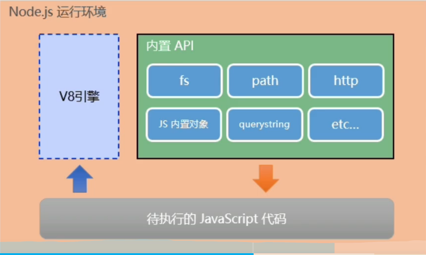
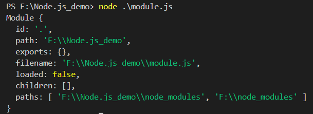
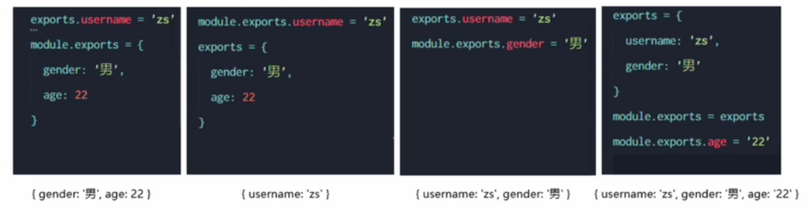
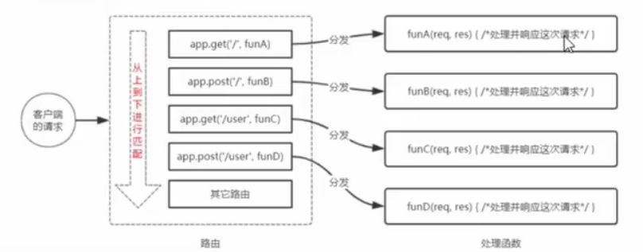
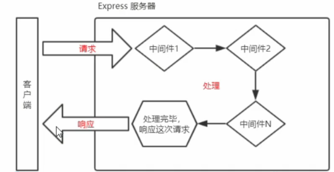
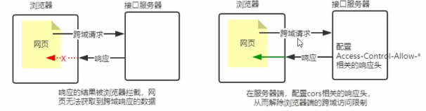
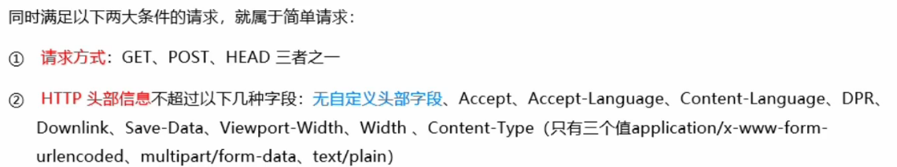
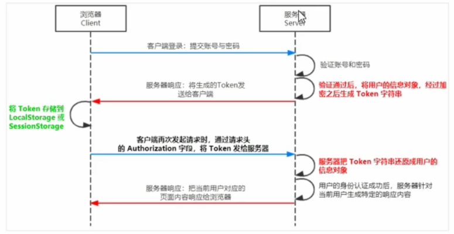
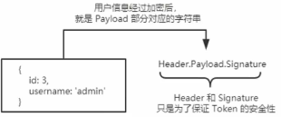

### 初识Node.js

#### Node.js简介

1. ##### 什么是Node.js

   Node.js是一个基于chrome V8引擎的JavaScript运行环境。

2. ##### Node.js官网：`http://nodejs.org/zh-cn`

3. ##### Node.js中的JavaScript运行环境

   

   > 注意：
   >
   > 1. 浏览器是JavaScript的前端运行环境
   > 2. Node.js是JavaScript的后端运行环境
   > 3. Node.js中无法调用DOM和BOM等浏览器内置API。

   

4. ##### Node.js可以做什么

   Node.js作为一个JavaScript的运行环境，仅仅提供了基础的功能和API，然而，基于Node.js提供的这些基础功能，出现了很多强大的工具和框架。

   1. 基于Expree框架   `http://www.expressjs.com.cn/`   可以快速构建Web应用
   2. 基于Electron框架   `http://electronjs.org/`   可以构建跨平台的桌面应用
   3. 基于restify框架   `http://restify.com/`   可以快速构架API接口项目
   4. 读写和操作数据库、创建使用的命令行工具辅助前端开发、etc...


#### Node.js安装

自己百度


#### Node.js环境下执行js代码

1. 打开终端

2. 输入**node**要执行的js文件路径

   


### fs文件系统模块

1. ##### 简介

   fs模块是Node官方提供的、用来操作文件的模块。它提供了系列的方法和属性，用来满足用户对文件的操作需求。

   如：

   - fs.readFile()方法，用来读取指定文件中的内容
   - fs.writeFile()方法，用来向指定的文件中写入内容

2. ##### 导入fs模块

   ```js
   const fs = require('fs')
   ```

#### 读取指定文件中的内容

1. ##### fs.readFile()的语法格式

   ```js
   fs.readFile(path[,options],callback)
   ```

   参数一：必选，表示文件路径
   参数二：可选，表示用什么编码格式来读取文件。
   参数三：必选参数，文件读取完成后，通过回调函数拿到读取的结果。

   ##### 实例代码

   ```js
   fs.readFile('./static/1.txt','utf8',(err,dataStr)=>{
       if(err){//如果读取成功  err的值为null
       //如果失败 err的值为错误对象， dataStr的值为undefined
       console.log('失败的结果',err);
       }
       //成功结果
       console.log('成功的结果',dataStr);
   })
   ```


#### 向指定文件中写入内容

1. ##### fs.writeFile()语法格式

   ```js
   fs.writeFile(file,data[,options],callback)
   ```

   参数一：必选，表示文件路径

   参数二：必选，表示要写入的内容

   参数三：可选，表示用什么编码格式来读取文件。默认utf8

   参数四：必选，表示文件完成后的回调函数。

   实例代码

   ```js
   fs.writeFile('./static/1.txt','123',(err)=>{
       //如果写入成功  err的值为null
       //如果写入失败 err的值为错误对象
       if(err){
           console.log('写入失败',err.message);
       }
       console.log('写入成功')
       
   })
   ```

> 注意：
>
> 1. fs.writeFile()可以用来创建文件，但是不能用来创建目录
> 2. 重复调用fs.writeFile()写入同一个文件，新写入的内容会覆盖之前的旧内容


#### 路径动态拼接问题

在使用fs模块操作文件时，如果提供路径是以**相对路径**开头时，很容易出现路径动态拼接错误的问题。

原因：代码在运行的时候，**会执行node命令时所处的目录**，动态拼接出被操作文件的完整路径。

 **解决方案**：

1. 使用绝对路径（不推荐）

   能够解决问题但是，会使代码移植性非常差，也不利于维护。

2. 使用\__dirname,  __dirname表示文件当前所属路径

   ```js
   fs.readFile(__dirname+'/static/1.txt','utf8',(err,dataStr)=>{
       if(err){
           console.log('读取失败！',err.message);
       }
       console.log('读取成功：',dataStr);
   
   })
   ```


### path路径模块

1. #####  简介：

   path模块使Node.js官方提供的、用来**处理路径**的模块。它提供了一系列的方法和属性，用来满足用户对路径的处理需求。

   如：

   - pah.join()方法，用来将多个路径片段拼接成一个完整的路径字符

   - path.basenaem()方法，用来从路径字符串中，将文件名解析出来

     

2. ##### 导入path模块

   ```
   const fs = require('path')
   ```


#### path.join()

1. **作用**：可以把多个路径片段拼接为完整的路径字符串。

2. ##### 语法格式

   ```
   path.join([...paths])
   ```

   - ...paths: 路径片段，通过逗号分隔
   - 返回值：`<string>`

3. ##### 代码示例

   **解决路径动态拼接问题**

   ```
   const path1 = path.join(__dirname,'./static/1.txt')
   //path.join中路径./表示当前路径不会对拼接造成影响。
   ```

   

   **注意** ：  `../`路径会抵消一个前一个路径

   ```
   const path2 = path.join('/a','/b/c','../','d')
   //输出   \a\b\d
   ```


#### path.basename()

1. **作用**: 可以获取路径中最后一部分，经常通过这个方法获取路径中的文件名

2. ##### 语法格式：

   ```
   path.basename(path[,ext])
   ```

   - path: 必选参数，表示一个路径的字符串
   - ext:  可选参数，表示文件扩展名

3. ##### 代码示例

   ```js
   const pathdemo2 = path.basename('/a/b/c/index.html')
   console.log(pathdemo2);  //输出  index.html
   const pathdemo22 = path.basename('/a/b/c/index.html','.html')
   console.log(pathdemo22);  //输出  index
   ```

拓展：

```js
// 正则匹配
\s表示空字符   \S表示非空字符
const regStyle = /<style>[\s\S]*<\/style>/
const regScript = /<script>[\s\S]*<\/script>/
```


### http模块

1. ##### 简介：

   http 模块 是Node.js官方提供的、用来创建web服务器的模块。通过http模块提供的http.createServer()方法，就能方便的把一台普通的电脑，变成一台web服务器，从而对外提供Web资源服务。

2. ##### 导入http模块

   ```
   const fs = require('http')
   ```


#### 创建最基本的web服务器

1. ##### 创建web服务器实例

   调用http.createServer()方法，即可快速创建一个web服务器实例：

   ```js
   const server = http.createServer()
   ```

2. ##### 为服务器实例绑定request事件

   ```js
   //使用服务器实例的.on()方法，为服务器绑定一个reques事件
   server.on('request', (req,res)=>{
       //只要客户端来请求我们自己的服务器，就会触发request事件，从而调用这个事件处理函数
       res.wirth
       console.log('Someone visit our web server');
   })
   ```

3. ##### 启动服务器

   ```js
   //调用server.listen(端口，cb回调)方法，即可启动web服务器
   server.listen(80,()=>{
       console.log('server running at http://127.0.0.1');
   })
   ```

4. ##### req请求对象

   只要服务器接收到客户端的请求，就会调用通过server.on()为服务器绑定的request事件处函数。

   如果想在事件处理函数中，访问与**客户端**相关的**数据或属性**，可以用如下的方式：

   ```js
   server.on('request', (req,res)=>{
       //req.url 是客户端请求的url地址
       //req.method是客户端的method请求类型
       const str= `你请求的地址为：${req.url},请求的方法类型为：${req.method}`
       console.log(str);   //  地址： /   类型 GET
   })
   //启动服务器
   server.listen(80,()=>{
       console.log('server running at http://127.0.0.1');
   })
   ```

5. ##### res响应对象

   在服务器的request事件处理函数中，如果想访问与**服务器**相关的**数据或属性**，可以使用如下方式

   ```js
   server.on('request', (req,res)=>{
       const str= `你请求的地址为：${req.url},请求的方法类型为：${req.method}`
       //为了防止中文乱码问题，需要设置响应头
       res.setHeader('Content-Type','text/html; charset=utf-8')
       //res.end能够向客户端发送指定的内容，并结束这次请求的处理过程
       res.end(str)
   })
   ```

6. ##### 根据url响应不同html内容

   ```js
   server.on('request', (req,res)=>{
       res.setHeader('Content-Type','text/html; charset=utf-8')
       const url=req.url;
       //设置默认响应内容
       let content = '<h1>404 Not found!</h1>';
       //判断用户路径，并显示匹配页面
       if(url=== '/' || url === '/index.html'){
           content = '<h1>首页</h1>'
       }else if(url === '/about.html'){
           content = '<h1>其他</h1>'
       }
       res.end(content)
   })
   //启动服务器
   server.listen(80,()=>{
       console.log('server running at http://127.0.0.1');
   })
   ```
   
   

### 模块化

编程领域的模块化，就是遵守固定规则，把一个大文件拆成独立并互相依赖的多个小模块。


#### Node.js中模块化的分类

Node.js根据模块来源的不同，将模块 分为3大类，为：

- ##### 内置模块（由Node.js官方提供的，例如fs、path、http等）

- ##### 自定义模块 （用户创建的每一个.js文件，都是自定义模块）

- ##### 第三方模块  （由第三方开发出来的模块，并非官方提供的内置模块，也不是用户创建的自定义模块，使用钱需要先下载）

加载模块注意：加载用户自定义模块时要加路径，其他只需要名字就可以了

```js
const m1 = require('./zdy.js')
//可以省略扩展名
const m1 = require('./zdy')
```


#### Node.js中的模块作用域

1. ##### 什么是模块作用域

   和函数作用域类似，在自定义模块中定义的变量、方法等成员，自能在当前模块内被访问，这种模块级别限制，叫做模块作用域。

   

2. ##### 向外共享模块作用域中的成员

   1. ##### module对象

      每一个.js自定义模块中都有一个module对象，它里面存储了和当前模块有关的信息，打印如下：

      

   2. ##### module.exports

      在自定义模块中，可以使用它，将模块内的成员共享出去，供外界使用。

      外界使用require()方法导入自定义模块时，得到的就是module.exports所指向的对象。

      ```js
      module.exports.username = 'zs'
      module.exports.sayHello = function(){
          console.log('Hello!');
      }
      ```

      

      > 注意：require()方法导入模块时，导入的结果，永远以module.exports指向的对象为准。

   3. ##### exports对象

      由于module.exports比较复杂，Node提供了exports对象。默认情况下，exports和module.exports指向同一个对象。最终共享的结果，还是以module.exports指向的对象为准。

      ```js
      exports.username = username
      exports.age = 20
      exports.sayHello = function(){
          console.log('Hello!');
      }
      ```

   4. ##### exports和module.exports的使用误区

      require()模块时，得到的永远是module.exports指向的对象

      

      > 建议在同一个模块内不要同时使用exports和module.exports

3. #### Node.js中的模块化规范

   Node.js遵循了CommonJS模块化规范，CommonJS规定了模块的特性和各模块之间如何相互依赖。

 

### npm与包


#### 包

1. #### 什么是包

   Node.js中的第三方模块又叫包。

   由于Node.js的内置模块仅提供了一些底层的API，导致在基于内置模块进行项目开发的时，效率很低。

2. ##### 可以用npm网站找包

   直接百度

3. ##### 安装包

   ```
   npm i 包名@版本 //不加版本默认最新版
   ```

4. ##### 包的语义化版本规范

   第一位数字：大版本

   第二位数字：功能版本

   第三位数字：Bug修复版本

5. ##### 包管理配置文件

   1. npm规定，在项目根目录中，必须提供一个叫package.json的包管理配置文件。用来记录与项目有关的一些配置信息。

      - 项目的名称、版本号、描述等

      - 项目中都用到了哪些包

      - 那些包只会在开发期间会用到

      - 那些包在开发和部署时都需要用到

   2. ##### 快速创建package.json

      ```
      npm init -y
      ```

      上述命令只能在英文的目录下成功运行且不能出现空格

      运行npm install 安装包时，npm包管理工具会自动把包的名称和版本号，记录到package.json中

   3. ##### dependencies节点

      记录你使用npm install安装了哪些包

   4. ##### devDependencies节点

      如果某些包只在项目开发阶段会用到，在项目上线之后不会用到，则建议把这些包记录到devDependencies节点中。

      ```
      npm i 包名 -D //-D写到包名前面也是可以的 
      或
      npm install 包名 --save-dev
      ```

      上述命令能将包记录到devDependencies节点中

6. #### npm install  

   ```
   npm install 或 npm i
   ```

   读取package.json，下载所有依赖包

7. #### 卸载包

   ##### npm uninstall

   ```
   npm uninstall 包名
   ```

   卸载指定的包，并会把卸载的包，自动从package.json的dependencies中移除掉

   

1. #### 下包慢的问题

下载包时，默认从国外的`http://registry.npmjs.org/`服务器下载的，网络传输会很慢

#### 切换npm的下包镜像源

```
//查看当前下包的服务器地址
npm config get registry

//将下包的镜像切换为淘宝镜像源
npm config set registry=https://registry.npm.taobao.org/

//检查镜像源是否下载成功
npm config get registry
```

1. #### nrm

   能够更方便的切换下包的镜像源。

   ```
   //通过npm包管理器，将nrm安装为全局可用的工具
   npm i nrm -g
   //查看所有可用的镜像源
   nrm ls
   //将下包的镜像源切换为taobao镜像
   nrm use taobao
   ```

#### 包的分类

1. ##### 项目包

   哪些被安装到项目的**node_modules**目录中的包，项目包。

   又分为：

   - 开发依赖包（devDependencies节点中的包，只在开发期间用）
   - 核心依赖包（dependencies节点中的包，在开发期间何项目上线后都会用到）

2. ##### 全局包

   ```
   npm i 包名 -g
   
   //卸载
   npm uninstall 包名 -g
   ```

   全局包会被安装到`C:\Users\用户目录\AppData\roaming\npm\node_modules目录下`。

3. i5ting_toc

   i5ting_toc是一个可以把md文档转为html页面的小工具，使用步骤如下：

   ```
   //全局安装i5ting_toc
   npm i i5ting_toc -g
   
   //调用 i5ting_toc ，轻松实现md转html的功能
   i5ting_toc -f 要转的md文件路径 -o
   ```


#### 规范的包结构

一个规范的包必须符合以下三点要求：

- ##### 包必须以单独的目录而存在

- ##### 包的顶级目录下必须包含package.json这个包管理配置文件

- ##### package.json中必须包含name，version（版本号），main（包的入口） 这三个属性


### 模块的加载机制

1. ##### 优先从缓存中加载

   模块在第一次加载后被缓存。这也意味着多次调用require()不会导致模块的代码被执行多次。

   > 注意：不论时内置模块、用户自定义模块、还是第三方模块，它们都会优先从缓存中加载，从而提高模块的加载效率。

2. ##### 内置模块加载机制

   内置模块是由Node.js官方提供的模块，内置模块的加载优先级最高

   > 假如你在node_modules中装了一个和内置模块同名的包，默认加载内置模块

3. ##### 自定义模块的加载机制

   加载自定义模块时，必须以`./`或`../`开头的路径标识符。如果没有node会把它当作内置模块或第三方模块加载。

   如果导入自定义模块时省略了扩展名，Node.js会**按顺序**分别尝试加载以下文件：

   1. 按照确切的**文件名**进行加载

   2. 补全**.js**扩展名进行加载

   3. 补全**.json**扩展名进行加载

   4. 补全**.node**扩展名进行加载

   5. 加载失败，终端报错

      

4. ##### 第三方模块的加载机制

   如果传递require()的模块标识符不是一个内置模块，也没有以`./`或`../`开头，则Node.js会从当前模块的父目录开始，尝试从 /node_modules 文件夹中加载第三方模块。

   **如果没有找到对应的第三方模块，则移动到上一次父目录中，进行加载，直到文件系统的根目录。**

   

5. ##### 目录作为模块

   当把目录作为模块标识符，传递给require()进行加载的时候，有三种加载方式：

   

   - 在被加载的目录下查找package.json的文件，并找到main属性，作为require()加载的入口
   - 如果上面的不行，则Node.js会视图加载目录下的index.js文件。
   - 如果上面两步都失败，则Node.js会在终端打印错误消息，报告模块的缺失：Error:Cannot find module 'xxx'


### Express


#### Express简介

1. ##### 官方概念

   Express是基于Node.js平台，快速、开放、极简的Web开发框架。

   **理解：**Express的作用和http模块类似，是专门用来创建Web服务器的。

   **本质:**就是一个npm上的第三方包，提供了快速创建Web服务器的便捷方法。

   官网：https://expressjs.com/

2. ##### 常见的两种服务器

   - web网站服务器：专门对外提供Web网页资源的服务器。
   - API接口服务器：专门对外提供API接口的服务器

   Express可以快速创建它们


#### Express的基本使用

1. ##### 安装

   ```
   npm i express@4.17.1
   ```

2. ##### 创建基本的Web服务器

   ```js
   //导入express
   const express = require('express')
   
   //创建web服务器
   const app = express()
   
   //调用app.listen(端口号，启动成功后的回调函数)，启动服务器
   app.listen(80,()=>{
       console.log('express server running at http://127.0.0.1');
   })
   ```

3. ##### 监听GET请求

   ```js
   app.get('请求URL',(rep,res)=>{处理函数})
   //参数一：客户端请求的url地址
   //参数二：请求对应的处理函数
       req：请求对象
       res：响应对象
   ```

4. ##### 监听POST请求

   ```
   app.post('请求URL',(rep,res)=>{处理函数})
   ```

5. ##### 把内容响应给客户端

   **res.send()**

   ```js
   app.get('/user',(rep,res)=>{
       //向客户端响应一个JSON对象
       res.send({name:'马牛逼',age:28,gender:'男'})
   })
   app.post('/user',(rep,res)=>{
       //向客户端响应一个文本字符串
       res.send('请求成功')
   })
   ```

6. ##### 获取URL中携带的查询参数

   **req.query**

   ```js
   app.get('/user',(rep,res)=>{
       //默认是一个空对象
       //客户端可以使用？naem=zs&age=20这种字符串形式，发送到服务器的参数
       //rep.query访问得到
       console.log(rep.query); 
   })
   ```

7. ##### 获取URL中的动态参数

   **req.params**

   ```js
   //:id是一个动态的参数,且：是固定的但id不是
   app.get('/user/:id',(rep,res)=>{
       //rep.params是动态匹配的url参数，默认也是空对象
       console.log(rep.params); 
       const str =rep.params 
       res.send(str)
   })
   ```


#### 托管静态资源

1. ##### express.static()

   通过这个函数我们可以非常方便地创建一个静态资源服务器。

   ```js
   app.use(express.static('static'))
   /text
   /img
   ```

   > **存放静态文件的目录名不会出现在url中**

2. ##### 托管多个静态资源目录

   ```js
   app.use(express.static('static'))
   app.use(express.static('files'))
   //多次调用函数就可以了
   ```

   > **访问静态资源文件时，express.static函数会根据目录的添加顺序查找所需的文件。**

3. ##### 挂载路径前缀

   ```js
   app.use('/public',express.static('public'))
   //只需要在前面加个路由前缀就可以了
   /public/img
   /public/text
   ```


#### nodemon

1. ##### 作用

   nodemon可以帮助我们监听**项目文件的变动**，当代码被修改后，nodemon会自动帮我们重启项目，极大方便了开发和调试。

2. ##### 安装

   ```
   npm i -g nodemon
   ```

3. ##### 使用

   ```
   //终端中
   //之前启动项目
   node app.js
   
   //使用nodemon实现自动重启
   nodemon app.js
   ```

   

### Express路由


#### 概念

在Express中，路由指的指的是客户端的请求与服务器处理函数之间的映射关系。

Express中的路由分为3部分，

- 请求的类型
- 请求的URL地址
- 处理函数

格式如下：

```js
app.METHOD(PATH,HANDLER)
```


1. ##### 路由的匹配过程

   每当一个请求达到服务器之后，需要先经过路由的匹配，只有匹配成功之后，才会调用对应的处理函数。

   在匹配时，会按照路由的顺序进行匹配，如果请求类型和请求的URL同时匹配成功，则Express会将这次请求，转交给对应的function函数进行处理。

   

   

#### 路由的使用

1. ##### 最简单的用法

   把路由挂载到app上

   ```js
   app.get('/',(req,res)=>{res.send('Hello World')})
   app.post('/',(req,res)=>{res.send('Hello World')})
   ```

2. ##### 模块化路由

   为了方便对路由进行模块化管理，Express不建议路由直接挂载到app上，推荐将路由抽离为单独的模块。

   步骤如下：

   - 创建路由模块对应的.js文件
   - 调用express.Router()函数创建路由对象
   - 向路由对象上挂载具体的路由
   - 使用module.exports向外共享路由对象
   - 使用app.use()函数注册路由模块

3. ##### 创建路由模块

   ```js
   const express = require('express')  //导入express
   const router = express.Router()     //创建路由对象
   
   router.get('/user/list',(req,res)=>{
       res.send('Get user list.')
   })
   router.post('/user/add',(req,res)=>{
       res.send('Add new user.')
   })
   
   
   module.exports = router  //向外导出
   ```

4. ##### 注册路由模块

   ```js
   const userRouter = require('./router/路由的使用') //导入路由模块
   
   app.use(userRouter)  //注册路由模块
   ```

5. ##### 为路由模块添加前缀

   类似托管静态资源

   ```js
   app.use('/api',userRouter)
   ```


### Express中间件


#### 概念

中间件(Middleware)，特指业务流程的中间处理环节


1. ##### Express中间件的调用流程

   当一个请求到达Express服务器之后，可以连续调用多个中间件，从而对这次请求进行预处理。 

   

2. ##### Express中间件的格式

   函数中有next参数就代表这是个中间键函数

   ```js
   const express = require('express')
   const app = express()
   
   app.get('/',(req,res,next)=>{  //req,res,next 是固定写法
       next();
   })
   ```

3. ##### next函数的作用

   next函数是实现多个中间件连续调用的关键，它表示把流转关系转交给下一个中间件或路由。

   

#### 中间件初体验

1. ##### 定义中间件函数

   ```js
   const mw = function(req,res,next){
       console.log('这是一个最简单的中间件函数');
       next()   //放行
   }
   ```

2. ##### 全局生效的中间件

   客户端发起的任何请求，到达服务器之后，都会触发的中间件，叫做全局生效的中间件。

   通过调用 app.use(中间件函数),即可定义一个全局生效的中间件。

   ```js
   const mw = function(req,res,next){
       console.log('这是一个最简单的中间件函数');
       next()   //放行
   }
   //全局生效的中间件
   app.use(mw)
   ```

3. ##### 定义全局中间件的简化形式

   ```js
   app.use( function(req,res,next){
       console.log('这是一个最简单的中间件函数');
       next()   //放行
   })
   ```

4. ##### 中间件的作用

   多个中间件之间，共享同一份req和res.基于这样的特性，我们可以在上游的中间件中，统一为req或res对象添加自定义的属性或方法，供下游的中间件或路由进行使用。

   ```js
   const express = require('express')
   const app = express()
   
   app.use(function(req,res,next){
       req.number = 2
       next()   //放行
   })
   
   app.get('/user',(req,res)=>{
       console.log(req.number);
   })
   
   app.listen(80)
   ```

   

5. ##### 定义多个全局中间件

   app.use()可以连续定义多个全局中间件。客户端请求到达服务器之后，会按照中间件定义的先后顺序依次进行调用。

   ```js
   app.use(function(req,res,next){
       console.log('调用了第一个全局中间件');
       next()   //放行
   })
   app.use(function(req,res,next){
       console.log('调用了第二个全局中间件');
       next()   //放行
   })
   app.use(function(req,res,next){
       console.log('调用了第三个全局中间件');
       next()   //放行
   })
   
   app.get('/user',(req,res)=>{  //请求这个路由会一次触发上述中间件
       console.log('user');
   })
   ```

   

6. ##### 局部生效的中间件

   不适用app.use()定义的中间件，叫做**局部生效的中间件**，

   ```js
   const mw = function(req,res,next){
       console.log('这是一个最简单的中间件函数');
       next()   //放行
   }
   
   app.get('/user',mw,(req,res)=>{ //中间件只会影响这个路由
       console.log('user');
   })
   ```

7. ##### 定义多个局部中间键

   ```js
   app.get('/user',mw1,mw2，(req,res)=>{ //中间件只会影响这个路由
       console.log('user');
   })
   //或者
   app.get('/user',[mw1,mw2]，(req,res)=>{ //中间件只会影响这个路由
       console.log('user');
   })
   
   //两种写法完全等价
   ```

8. ##### 中间件的五个使用注意事项

   - 一定要在路由之气那注册中间件
   - 客户端发送过来的请求，可以连续调用多个中间件进行处理
   - 执行完中间件的业务代码之后，不要忘记调用next()函数
   - 为了防止代码逻辑混乱，调用next函数后不要再写额外的代码
   - 连续调用多个中间件时，多个中间件之间，共享req和res对象


#### 中间件的分类

一共5大类

1. ##### 应用级别的中间件

   通过app.use(),app.get()或app.post()，绑定到app实例上的中间件

   全局中间件，局部中间件

   

2. ##### 路由级别的中间件

   绑定到express.Router(a)实例上的中间件，叫做路由级别的中间件。

   ```js
   const express = require('express')
   const router = express.Router()
   router.use((req,res,next)=>{
       console.log('Time',Date.now())
       next()
   })
   ```

   

3. ##### 错误级别的中间件

   必须有四个参数的中间件

   ```js
   app.get('/',(req,res)=>{    //路由
       throw new Error('服务器内部发生了错误') //抛出一个自定义的错误
       res.send('Home Page')
   })
   app.use((err,req,res,next)=>{
       console.log('发生了错误'+err.message) //在服务器打印错误信息
       res.send('Error!'+err.message)  //在客户端响应错误相关的内容
   })
   ```

   > **除了错误级别的中间件，其他中间件，必须在路由之前进行配置**

4. ##### Express内置的中间件

   自Express4.16.0版本以来，Express内置了三个不常用的中间件，极大的提高了Express项目的开发效率：

   - express.static 快速托管静态资源的内置中间件

   - express.json解析JSON格式的请求数据（仅在4.16.0+版本可用）

   - express.urlencoded解析URL-encoded格式的请求体数据（仅在4.16.0+版本可用）

     ```js
     app.use(express.json())
     //配置解析 application/json 格式数据的内置中间件
     //在服务器中可以使用req.body这个属性，来接收客户端发送过来的请求体数据
     //默认情况下，如果不配置表单数据的中间件，则req.body默认为undefined
     app.use(express.urlencoded({extended:false}))
     //配置解析 application/x-www-form-urlencoded 格式数据的内置中间件
     ```

     

5. ##### 第三方的中间件 

   由第三方开发出来的中间件，叫做第三方中间件。

   - 安装第三方中间件
   - 使用require导入
   - app.use()注册并使用中间件


### Express写接口


#### 创建基本的服务器

```js
const express = require('express')
const app = express()

app.listen(80,()=>{
    console.log('Express server running at http://127.0.0.1')
})
```


#### 创建API路由模块

```js
//apiRouter.js 
const express = require('express')
const apiRouter = express.Router()
//在这里挂载对应的路由
module.exports = apiRouter


//app.js : 导入并注册路由模块
const express = require('express')
const app = express()
const apiRouter = require('.apiRouter.js')
//把路由模块，注册到app上
app.use('/api',apiRouter)
```


#### 编写GET接口

```js
apiRouter.get('/get',(req,res)=>{
    //获取到客户端通过查询字符串，发送到服务器的数据
    const query = req.query
    //调用res.send()方法，把数据响应给客户端
    res.send({
        status:0,			//状态，0表示成功，1表示失败
        msg:'GET请求成功',	 //状态描述
        data:query 			//需要响应给客户端的具体数据
    })
})
```


#### 编写POST接口

```js
apiRouter.post('/post',(req,res)=>{
    //获取到客户端通过请求体，发送到=服务器的URL-encoded数据
    const body = req.body
    //调用res.send()方法，把数据响应给客户端
    res.send({
        status:0,			//状态，0表示成功，1表示失败
        msg:'POST请求成功',	 //状态描述
        data:body			//需要响应给客户端的具体数据
    })
})
```

> 要获取URL-encoded格式的请求体数据，必须配置中间件app.use(express.urlencoded({extended:false}))


### CORS 跨域资源共享

#### 接口的跨域问题

- ##### CORS(主流的解决方案，推荐使用)

- JSONP(有缺陷的解决方案：只支持GET请求)


1. ##### 使用cors中间件解决跨域问题

   cors是Express的一个第三方中间件。通过安装和配置cors中间件，可以很方便地解决跨域问题。

   1. 运行npm i cors 安装中间件
   2. 使用const cors = require('cors')导入中间件
   3. 在路由之前调用app.use(cors())配置中间件


#### CORS是什么

CORS（Cross-Origin Resource Sharing 跨域资源共享）由一系列**HTTP响应头**组成，**这些HTTP响应头决定浏览器是否阻止前端JS代码跨域获取资源**。


浏览器的同源安全策略默认会阻止网页“跨域”获取资源。但如果接口服务器**配置了CORS相关的HTTP响应头**，就可以**解决浏览器的跨域访问限制**。




#### CORS 的注意事项

1. CORS主要在服务器端进行配置。客户端浏览器无须做任何额外的配置，即可请求开启了CORS的接口。
2. CORS在浏览器中有兼容性。只有支持XMLHttpRequest Level2的浏览器，才能正常访问开启了CORS的服务器接口


#### CORS响应头部 -Access-Control-Allow-Origin

下面的字段值将只允许来自http://itcast.cn的请求：

```
res.setHeader('Access-Control-Allow-Origin','http://itcast.cn')
```

允许所有就用*

```
res.setHeader('Access-Control-Allow-Origin','*')
```

#### CORS响应头部 -Access-Control-Allow-Headers

默认情况下，CORS仅支持客户端向服务器发送如下的9个请求头：

Accept、Accept-Language、Content-Language、DPR、Downlink、Save-Data、Viewport-Width、Width、Content-Tyoe（值仅限于text/plain、multipart/form-data、application/x-www-form-urlencoded三者之一）

如果客户端向服务器**发送了额外的请求头信息**，则需要在**服务器端**，通过Access-Control-Allow-Headers**对额外的请求头进行声明**，否则这次请求会失败

```js
//允许客户端额外向服务器发送Content-Type请求头和X-Custom-Header请求头
//注意：多个请求头之间使用英文的逗号进行分割
res.setHeader('Access-Control-Allow-Headers','Content-Type,X-Custom-Header')
```


#### CORS响应头部 -Access-Control-Allow-Methods

默认情况下 CORS仅支持客户端发起GET、POST、HEAD请求
如果客户端希望通过PUT、DELETE等方式请求服务器的资源、则需要在服务器端、通过Access-Control-Allow-Methods来指明实际请求所允许使用的HTTP方法

```JS
//只允许POST、GET、DELETE、HEAD请求方法
res.setHeader('Access-Control-Allow-Methods','POST,GET,DELETE,HEAD')
//允许所有的HTTP请求方法
res.setHeader('Access-Control-Allow-Methods','*')
```


#### CORS请求的分类

客户端在请求CORS接口时，根据请求方式和请求头的不同，可以将CORS的请求分为两大类，分别是：

1. ##### 简单请求

   

2. ##### 预检请求

   

   在浏览器与服务器正式通信之前，浏览器会先发送OPTION请求进行预检，以获知服务器是否允许该实际请求，所以这一次的OPTION 请求称为“预检请求”。服务器成功响应预检请求后，才会发送真正的请求，并携带真实数据。

3. ##### 区别

   简单请求的特点：客户端和服务器之间只会发生一次请求
   预检请求的特点：客户端和服务器之间会发生两次请求，OPTION预检请求成功之后，才会发起真正的请求


#### JSONP接口

**概念**：浏览器通过\<script>标签的src属性，请求服务器上的数据，同时，服务器返回一个函数的调用。这种请求数据的方式叫做JSONP。

**特点**：

​            1.JSONP不属于真正的Ajax请求，因为它没有使用XMLHttpRequest这个对象。

​			2.JSONP仅支持GET请求，不支持POST、PUT、DELETE等请求。

1. ##### 创建JSONP接口的注意事项

   如果项目中已经配置了CORS跨域资源共享，为了防止冲突，必须在配置CORS中间件之前生命JSONP的接口。否则JSONP接口会被处理成开启了CORS的接口。

   ```js
   //优先创建 JSONP接口【这个接口不会被处理成CORS接口】
   app.get('/api/jsonp',(req,res)=>{})
   
   //再配置CORS中间件【后续的所有接口，都会被处理成CORS接口】
   app.use(cors())
   
   //开启了CORS的接口
   app.get('/api/get',(req,res)=>{})
   ```

2. ##### JSONP接口的实现步骤

   - 获取客户端发送过来的回调函数的名字
   - 得到要通过JSONP形式发送给客户端的数据
   - 根据前两步得到的数据，拼接出一个函数调用的字符串
   - 把上一步拼接得到的字符串，响应给客户端的\<script>标签进行解析执行

3. ##### 实现代码

   ```js
   app.get('/api/jsonp',(req,res)=>{
       //获取客户端发送过来的回调函数
       const funcName = req.query.callback
       //得到要通过 JSONP 形式发送给客户端的数据
       const data = {naem:'zs',age:20}
       //根据前两步得到的数据，拼接出一个函数调用的字符串
       const scirptStr = `${funcName}(${JSON.stringify(data)})`
       //把上一步拼接得到的字符串，响应给客户端的<script>标签进行解析执行
       res.send(scriptStr)
   })
   ```

4. 在网页中使用jQuery发起JSONP请求

   调用$.ajax()函数，提供JSONP的配置选项，从而发起JSONP请求。

   ```js
   $('#butGET').on('click',()=>{
               $.ajax({
                   type:'GET',
                   url:'http://127.0.0.1/api/jsonp',
                   dataType:'jsonp',  //表示要发起JSONP的请求
                   success:(res)=>{
                       console.log(res);
                   }
               })
           })
   ```

   

### mysql模块


#### 安装

```
npm i mysql
```


#### 配置mysql

```js
//导入mysql模块
const mysql = require('mysql')
//与mysql数据库建立连接关系
const db = mysql.createPool({
    host:'127.0.0.1',  //数据库的ip地址
    user:'root',       //登录数据库的账号
    password: '1', //登录数据库的密码
    database: 'db2' //指定你要操作的数据库
})
```

#### db.query()函数

指定要执行的sql语句，通过回调函数拿到执行的结果：

1. ##### 查询

   ```js
   //测试mysql模块能否正常工作
   db.query('SELECT * FROM 表名',(err,results)=>{
       //mysql模块工作期间报错了
       if(err) return console.log(err.message);
       //能够成功的执行sql语句
       console.log(results);
   })
   ```

   > 如果执行的是select语句，则执行结果是数组

2. ##### 插入

   ```js
   const user = {username:'Souder-Man',password:'pcc321'}
   const sqlStr = 'INSERT INTO users(username,password) values(?,?)'
   db.query(sqlStr,[user.username,user.password],(err,results)=>{
       if(err) return console.log(err.message);
       if(results.affectedRows === 1){
           console.log('插入成功');
       }
   })
   ```

   - 简化

     ```js
     const user = {username:'Souder-Man',password:'pcc321'}
     
     const sqlStr = 'INSERT INTO users SET ?'
     
     db.query(sqlStr,user,(err,results)=>{
         if(err) return console.log(err.message);
         if(results.affectedRows === 1){
             console.log('插入成功');
         }
     })
     ```

3. ##### 更新

   ```js
   const user = {id:7,username:'aaa',password:'000'}
   
   const sqlStr = 'UPDATE users SET usernaem=?,password=? WHERE id=?'
   //调用db.query() 执行SQL语句的同时，使用数组依次为占位符指定具体的值
   db.query(sqlStr,[user.username,user.password,user.id],(err,results)=>{
       if(err) return console.log(err.message);
       if(results.affectedRows === 1){
           console.log('数据更新成功');
       }
   })
   ```

   - 简便

     ```js
     const user = {id:7,username:'aaa',password:'000'}
     
     const sqlStr = 'UPDATE users SET ？ WHERE ？'
     //调用db.query() 执行SQL语句的同时，使用数组依次为占位符指定具体的值
     db.query(sqlStr,[user,user.id],(err,results)=>{
         if(err) return console.log(err.message);
         if(results.affectedRows === 1){
             console.log('数据更新成功');
         }
     })
     ```

4. ##### 删除

   ```js
   const sqlStr = 'DELETE FROM users WHERE id=？'
   //调用db.query() 执行SQL语句的同时，使用数组依次为占位符指定具体的值
   
   //如果只有一个占位符，则可以省略数组
   db.query(sqlStr,7,(err,results)=>{
       if(err) return console.log(err.message);
       if(results.affectedRows === 1){
           console.log('数据删除成功');
       }
   })
   ```

5. ##### 标记删除

   DELETE会真正的把数据从表中删除。保险起见，推荐用标记删除的形式，来模拟删除的动作。

   标记删除就是在表中设置类似于status这样的状态字段，来标记当前这条数据是否被删除。

   


### Web开发模式

#### 服务端渲染的Web开发模式

1. ##### 概念

   服务器发送给客户端的HTML页面，是在服务器通过字符串的拼接，动态生成的。因此，客户端不需要使用Ajax额外请求页面的数据

   ```js
   app.get('/',(req,res)=>{
       const user = {name:'zs',age:20}
       const html = `<h1>姓名：${user.name}，年龄：${user.age}</h1>`
       //把页面内容响应给客户端
       res.send(html)
   })
   ```

   

2. ##### 优缺点

   **优点**：

   - 前端耗时少。

     因为服务器端负责动态生成HTML内容，浏览器只需要直接渲染页面即可。尤其是移动端，更省电。

   - 有利于SEO。

     因为服务器端响应的是完整的HTML页面内容，所以爬虫更容易爬取获得信息，更利于SEO。

   缺点：

   - 占用服务器端资源。

     服务器端完成HTML页面内容的拼接，如果请求较多，会对服务器造成一定的访问压力。

   - 不利于前后端分离，开发效率低。

     使用服务器端渲染，则无法进行分工合作，尤其对于前端复杂度高的项目，不利于项目高效开发。


#### 前后端分离的Web开发模式

1. 概念

   依赖于Ajax技术的广泛应用。简而言之，前后端分离的Web开发模式，就是后端只负责提供API接口，前端使用Ajax调用接口的开发模式。

2. 优缺点

   优点：

   - 开发体验好。

     前端专注UI页面的开发，后端专注于api的开发，且前端有更多的选择性。

   - 用户体验好。

     Ajax技术的广泛应用，极大的提高了用户的体验，轻松实现页面的局部刷新。

   - 减轻了服务端的渲染压力。

     页面最终是在每个用户的浏览器中生成的。

   缺点：

   - 不利于SEO。

     完整的HTML页面需要在客户端动态拼接完成，所以爬虫无法爬取页面的有效信息。（解决方案：利用Vue、React等前端框架的SSR（server side render）技术能够很好的解决SEO问题）


### 身份认证

身份认证（Authentication）又称“身份验证”、“鉴权”，是指通过一定的手段，完成对用户身份的确认。

1. 不同开发模式下的身份认证
   - 服务端渲染推荐使用Session认证机制
   - 前后端分离推荐按使用JWT认证机制


#### Session认证机制

1. ##### HTTP协议的无状态性

   指客户端的每次HTTP请求都是独立的，连续多个请求之间没有直接的关系，服务器不会主动保留每次HTTP请求的状态。

2. ##### 如何突破HTTP无状态的限制

   使用Cookie   就像现实生活中的会员卡身份认证方式。

3. ##### Cookie

   是存储在用户浏览器中的一段不超过4kb的字符串。它由一个name、value和其他几个用于控制Cookie有效期、安全性、使用范围的可选属性组成。

   

   不同域名下的Cookie各自独立，每当客户端发起请求时，会自动把当下域名下所有未过期的Cookie一同发送到服务器。

   ##### Cookie四大特性:

   - 自动发送
   - 域名独立
   - 过期时限
   - 4kb限制

   ##### Cookie在身份认证中的作用

   客户端第一次请求服务器的时候，服务端通过响应头的形式，向客户端发送一个身份认证的Cookie，客户端会自动将Cookie保存在浏览器中。

   

   随后，当客户端浏览器每次请求服务器的时候，浏览器会自动将身份认证相关的Cookie，通过请求头的形式发送给服务器，服务器即可验明客户端的身份。

   

   ##### Cookie不具有安全性

   浏览器提供了读写Cookie的API，因此Cookie很容易被伪造，不建议服务器将重要的隐私数据，通过Cookie的形式发送给浏览器。


#### expess-session 中间件

1. ##### 安装

   ```
   npm i expess-session
   ```

2. ##### 配置express-session中间件

   ```js
   const session = require('express-session')
   
   //配置Session中间件
   app.use(session({
       secret:'keyboard cat', //secret 属性的值可以为任意字符串
       resave:false,  //固定写法
       saveUninitialized:true //固定写法
   }))
   ```

3. ##### 向session中存数据

   当express-session中间件配置成功后，可通过req.session来访问和使用session对象，从而存储用户的关键信息：

   ```js
   app.post('/api/login',(req,res)=>{
       if(req.body.username !=='admin' || req.body.password !== '000000'){
           return res.send({
               status:1,
               mapGetters:'登陆失败'
           })
       }
       req.session.user = req.body //将用户的信息存储到Session中
       req.session.islogin = true  //将用户的登录状态，存储到Session中
       res.send({
           status:0,
           msg:'登录成功'
       })
   })
   ```

4. ##### 从session中取数据

   ```js
   app.get('/api/username',(req,res)=>{
       if(!req.session.islogin){
           return res.send({
               status:1,
               msg:'fail'
           })
       }
       res.send({status:0,msg:'success',username:req.session.user.username})
   })
   ```

5. ##### 清空session

   req.session.destroy()

   ```js
   app.post('/api/logout',(req,res)=>{
       //清空当前客户端对应的session信息
       req.session.destroy()
       res.send({
           status:0,
           msg:'退出登录成功'
       })
   })
   ```

   > 只是清空当前用户的session

#### Session认证的局限性

Session认证机制需要配合Cookie才能实现。由于Cookie默认不支持跨域访问，所以，当涉及到跨域请求后端接口的时候，需要做很多额外的配置，才能实现跨域Session认证。


- 当前端请求接口不存在跨域问题的时候，推荐使用Session身份认证机制。
- 当前端需要跨域请求后端接口的时候，不推荐使用Session身份认证机制，推荐按使用JWT认证机制。


#### JWT认证

JWT（JSON Web Token）是目前最流行的跨域认证解决方案。

1. ##### JWT工作原理

   

   > 用户的星系通过Token字符串的形式，保存在客户端浏览器中。服务器铜鼓还原Token字符串的形式来认证用户的身份。

2. ##### JWT组成

   由三部分组成，分别是Header(头部)、Payload(有效荷载)、Signature(签名)。

   ```
   Header.Payload.Signature //用点号分割
   ```

   - Payload部分才是真正的用户信息，它是用户信息经过加密之后生成的字符串。

   - 其它两个是安全性相关的部分，只是为了保证Token的安全性。

     

3. ##### JWT的使用方式

   客户端收到服务器返回的JWT之后，通常会将它存储在localStorage或sessionStorage中。

   此后，客户端每次与服务器通信，都要带上这个JWT的字符串，从而进行身份认证。推荐的做法是把**JWT放在HTTP请求头的Authorization字段中**

   ```
   Authorization: Bearer <token>
   ```


#### 在Express中使用JWT

1. ##### 安装

   ```
   npm i jsonwebtoken express-jwt
   ```

   - jsonwebtoken用于生成JWT字符串
   - express-jwt用于将JWT字符串解析还原成JSON对象

2. ##### 导入JWT相关包

   ```js
   const jwt = require('jsonwebtoken')
   const expressJWT = require('express-jwt')
   ```

3. ##### 定义secret密钥

   secret密钥就是一个用于加密和解密的密钥。

   1. 当生成JWT字符串的时候，需要使用secret密钥对用户的信息进行加密，最终得到加密好的JWT字符串

   2. 当把JWT字符串解析还原成JSON对象的时候，需要使用secret密钥进行解密。

      ```
      const secretKey = 'wuzhi No1 ^_^'
      ```

      

4. ##### 在登陆成功后生成JWT字符串

   调用jsonwebroken包提供的sign()方法，将用户的信息加密成JWT字符串，响应给客户端：

   ```js
   const tokenStr = jwt.sign({username:'admin',password:'000000'},secretKey,{expiresIn:'30h'})
       res.send({
           status:200,
           message:'登录成功！',
           token: tokenStr, //要发送给客户端的 token 字符串
       })
   ```

5. ##### 将JWT字符串还原为JSON对象

   客户端每次在访问哪些有权限接口的时候，都需要主动通过请求头中的Authorization字段，将Token字符串发送到服务器进行身份认证。

   此时，服务器可以通过express-jwt这个中间件，自动将客户端发送过来的Token解析还原成JSON对象:

   ```js
   app.use(expressJWT({secret:secretKey}).unless({path:[/^\/api\//]}))
   ```

6. ##### 使用req.user获取用户信息

   ```js
   app.get('/admin/getinfo',(req,res)=>{
       
       console.log(req.user);
       res.send({
           status:200,
           message:'获取用户信息成功！',
           data:req.user,  //要发送给客户端的用户信息
       })
   })
   ```

7. ##### 捕获解析JWT失败后产生的错误

   ```js
   app.use((err,req,res,next)=>{
       if(err.name === 'UnauthorizedError'){
           return res.send({status:401,message:'无效的token'})
       }
       //其他原因导致的错误
       res.send({status:500,message:'未知错误'})
   })
   ```

   

